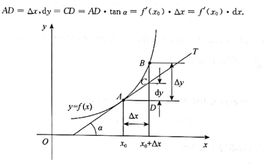
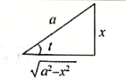
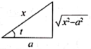
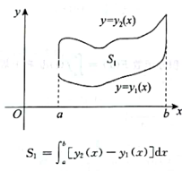
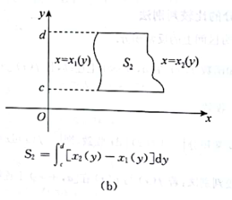
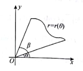
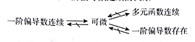

# 高等数学

## 函数、极限和连续

### 函数的概念和性质

1. 性质

   1. 有界性
   2. 奇偶性：

      - 奇函数 -> 定义域$D$关于原点对称, $f(-x)=-f(x)$
      - 偶函数 -> $f(x)=f(-x)$

        - 积分:

          - $f(x)$为奇函数, 则$\int_{-a}^a f(x)dx=0$
          - $f(x)$为偶函数, 则$\int_{-a}^a f(x)dx=2\int_0^af(x)dx$

   3. 周期性: 如$f(x+T)=f(x)$, 则函数f(x)是以$T$为周期的函数
   4. 单调性:

      1. 函数:

         1. 当$f'(x) > 0 (<0)$时, 函数单调递增(减);
         2. 当$f'(x) \geq 0 (\leq 0)$且等号有限个点处成立的话, $f(x)$单调递增(减)

      2. 数列: $X_{n+1}-X_n>0(<0)$, 数列单调递增(减)

2. 基本初等函数

   1. 幂函数$y=x^a(a \in \mathbb{R})$
   2. 指数函数$y=a^x(a是常数, 且a>0, a \ne 1)$

      | a的范围 |        $a>1$         |              $0<a<1$ |
      | :------ | :------------------: | -------------------: |
      | 单调性  |       单调递增       |             单调递减 |
      | 奇偶性  |       非奇非偶       |             非奇非偶 |
      | 定义域  | $(-\infty, +\infty)$ | $(-\infty, +\infty)$ |
      | 值域    |    $(0,+\infty)$     |        $(0,+\infty)$ |

   3. 对数函数: $y=log_ax(a是常数, 且a>0, a \ne 1)$

      | a的范围 |        $a>1$         |              $0<a<1$ |
      | :------ | :------------------: | -------------------: |
      | 单调性  |       单调递增       |             单调递减 |
      | 奇偶性  |       非奇非偶       |             非奇非偶 |
      | 定义域  |    $(0,+\infty)$     |        $(0,+\infty)$ |
      | 值域    | $(-\infty, +\infty)$ | $(-\infty, +\infty)$ |

   4. 三角函数:

      1. 正弦函数: $y=\sin x$
      2. 余弦函数: $y=\cos x$
      3. 正切函数: $y=\tan x$
      4. 余切函数: $y=\cot x$
      5. 正割函数: $y=\sec x= \frac{1}{\cos x}(偶函数, 周期T=2\pi)$
      6. 余割函数: $y=\csc x= \frac{1}{\sin x}(奇函数, 周期T=2\pi)$

   5. 反三角函数:

      1. 反正弦函数: $y=\arcsin x, y \in [-\frac{\pi}{2}, \frac{\pi}{2}]$
      2. 反余弦函数: $y=\arccos x, y \in [0, \pi]$
      3. 反正切函数: $y=\arctan x, y \in (-\frac{\pi}{2}, \frac{\pi}{2})$
      4. 反余切函数: $y=\arcctg x, y \in (0, \pi)$

***

### 极限的定义和性质

1. 极限的定义

   1. 数列极限: $\lim\limits_{n \to \infty} = A \iff \forall_\epsilon > 0 \exists N \in \mathbb{N}_+, 当n>N时, 有|x_n-A| < \epsilon$
   2. 函数极限: $\lim\limits_{n \to \infty} = A \iff \forall_\epsilon > 0 \exists X >0 , 当|x|>X时, 有|f(x)-A| < \epsilon$
   3. 函数极限: $\lim\limits_{n \to \infty} = A \iff \forall_\epsilon > 0 \exists \delta >0 , 当0 < |x-x_0|< \delta时, 有|f(x)-A| < \epsilon$

   - **注:**

     - 左极限 $\lim\limits_{x \to x_0^-} = A, 记为左极限f(x_0-0)=A$
     - 右极限 $\lim\limits_{x \to x_0^-} = A, 记为左极限f(x_0-0)=A$
     - 常见需区分左右极限的函数有:

     1. 指数函数:

        $$
        \lim\limits_{x \to -\infty}e^x = 0, 
        \lim\limits_{x \to a^+}e^{\frac{1}{x-a}} = +\infty, 
        \lim\limits_{x \to a^-}e^{\frac{1}{x-a}} = 0
        $$

     2. 反正切函数:

        $ \lim\limits_{x \to +\infty}\arctan x = \frac{\pi}{2},\lim\limits_{x \to -\infty}\arctan x = \frac{\pi}{2}$  
$\lim\limits_{x \to a^+}\arctan \frac{1}{x-a} = \frac{\pi}{2}, \lim\limits_{x \to a^-}\arctan \frac{1}{x-a} = -\frac{\pi}{2}$

     3. 绝对值函数: $\lim\limits_{x \to 0} \frac{|x|}{x}\left\{
        \begin{aligned}
           \lim\limits_{x \to 0^+} \frac{|x|}{x}=\lim\limits_{x \to 0^+} \frac{x}{x}=1, \\
        \lim\limits_{x \to 0^-} \frac{|x|}{x}=\lim\limits_{x \to 0^-} \frac{-x}{x}=-1
        \end{aligned}
        \right.$
     4. 取整函数: $\lim\limits_{x \to 0} [x] \left\{
        \begin{aligned}
        \lim\limits_{x \to 0^+} [x]=0, \\
        \lim\limits_{x \to 0^+} [x]=-1
        \end{aligned}
        \right.$
     5. 分段函数, 如$f(x)= \left\{
        \begin{aligned}
        f_1(x), x<a, \\
        f_2(x), x>a
        \end{aligned}
        \right.$  $f_1(x)\ne f_2(x)$

2. 函数极限性质

   1. 唯一性
   2. 局部有界性
   3. 局部保号性

3. 数列与子列的敛散性

   1. 若数列${x_n}$收敛于a(即$\lim\limits_{n \to \infty}x_n=a$), 则他的任一子列也收敛于a
   2. 

### 无穷小无穷大

1. 无穷小的运算

   1. 有限个无穷小的和差积仍是无穷小
   2. 有界变量与无穷小的乘积是无穷小
   3. 当 $x \to 0$, 有$o(x^m), o(x^n)分别为 x^m, x^n的高阶无穷小,且0<m<n$

      1. $o(x^m)\pm o(x^m) = o(x^m), o(x^m) \pm o(x^n) = o(x^m)$
      2. $x^m \cdot o(x^n) = o(x^{m+n}), 0(x^m) \cdot o(x^n) = o(x^m) $

2. 无穷小比阶

   1. 设两个函数$\alpha (x) 与 \beta (x)$满足$\lim\limits_{x \to \square} \alpha(x)= \lim\limits_{x \to \square} \beta(x)=0, 且\alpha(x) \neq 0$

      1. $\lim\limits_{x \to \square} \frac{\beta(x)}{\alpha(x)}=0, 称\beta(x)是比\alpha(x)高阶的无穷小, 记为\beta(x)=o(\alpha(x))$
      2. $\lim\limits_{x \to \square} \frac{\beta(x)}{\alpha(x)}=c(c\neq 0), 称\beta(x)和\alpha(x)是同阶无穷小$

         - **特别的:** , 若$\lim\limits_{x \to \square} \frac{\beta(x)}{\alpha(x)}=1, 称\beta(x)和\alpha(x)是等价无穷小$

      3. $\lim\limits_{x \to \square} \frac{\beta(x)}{\alpha(x)}=\infty, 称\beta(x)和\alpha(x)是低价无穷小$
      4. $\lim\limits_{x \to \square} \frac{\beta(x)}{[\alpha(x)]^k}=c(c\neq 0, k>0), 称\beta(x)是关于\alpha(x)是低价无穷小$

3. 无穷小与无穷大

   1. 若$\lim\limits_{x \to \square}f(x)=\infty, 则\lim\limits_{x \to \square}\frac{1}{f(x)}=0$, 即无穷大的倒数为无穷小
   2. 若$\lim\limits_{x \to \square}f(x)=0, 且f(x)\ne 0, 则\lim\limits_{x \to \square}\frac{1}{f(x)}=\infty$, 即非零无穷小的倒数为无穷大

***

### 极限运算

1. 四则运算

   1. 若$\lim\limits_{x \to \square}f(x)=A, \lim\limits_{x \to \square}g(x)=B(A,B \in \mathbb{R})$, 则:

      1. $\lim\limits_{x \to \square}[f(x)\pm g(x)]=f(x)\pm g(x)=A\pm B$
      2. $\lim\limits_{x \to \square}[f(x) \cdot g(x)]=\lim\limits_{x \to \square}f(x) \cdot \lim\limits_{x \to \square}g(x)=A\cdot B$
      3. $\lim\limits_{x \to \square}\frac{f(x)}{g(x)}=\frac{\lim\limits_{x \to \square}f(x)}{\lim\limits_{x \to \square}g(x)}=\frac{A}{B}$

2. "抓大头"思想

   1. $x \to 0$时, $x^{低}+x^{高} \sim x^{低}$
   2. 当x充分大时, $x^{低}+x^{高} \sim x^{高}$
   3. 当x充分大时, $(\ln x)^\beta < x^\alpha <e^{\gamma\alpha}$  
      $\lim\limits_{x \to \infty}\frac{a_m+x^m+a_{m-1}x^{m-1}+\cdots+a_1x+a_0}{b_nx^n+b_{n-1}x^{n-1}+\cdots+b_1x+b_0}= \left\{ \begin{array}{l} \infty, m>n \\ \frac{a_m}{a_n}, m=n, 其中a_mb_n \ne \\ a_3x + b_3y + c_3z = d_3\end{array}\right.$

3. 常用等价无穷小替换

   - 当$x \to 0$时:

     - 等价于x的情况($\sim x$)：

       - $\sin x \sim \arcsin x \sim \tan x \sim \arctan x \sim e^x-1 \sim \ln(1+x) \sim  x$

     - 等价于$\alpha x$的情况($\sim \alpha x$):

       - $(1+x)^\alpha \sim \alpha x$

     - 等价于$\frac{1}{2}x^2$的情况($\sim \frac{1}{2}x^2$):

       - $1-\cos x \sim x-\ln(1+x) \sim \sec x-1 \sim e^x-1-x \sim \frac{1}{2}x^2$

     - 等价于$\frac{1}{6}x^3$的情况($\sim \frac{1}{6}x^3$):

       - $x-\sin x \sim \arcsin x -x \sim \frac{1}{6}x^3$

     - 等价于$\frac{1}{3}x^3$的情况($\sim \frac{1}{3}x^3$):

       - $\tan x - x \sim x-\arctan x \sim \frac{1}{3}x^3$

     - 等价于$\frac{1}{2}x^3$的情况($\sim \frac{1}{4}x^3$):

       - $\tan x - \sin x \sim \frac{1}{2}x^3$

4. 洛必达法则

   - 设：

     1. 当$x \to a$时, 函数$f(x)及g(x)$都趋于0
     2. 在点$a$的某去领域内, $f'(x), g'(x)$都存在, 且$g'(x) \ne 0$
     3. $\lim \limits_{x \to a}\frac{f'(x)}{g'(x)}$存在(或无穷大),则：

        1. $\lim \limits_{x \to a}\frac{f(x)}{g(x)} = \lim \limits_{x \to a}\frac{f'(x)}{g'(x)}$

   - 注：

     1. 当$x \to \infty$时, 相应条件下洛必达法仍成立
     2. $\frac{\infty}{\infty}$型:

        1. $\lim\limits_{x \to a} f(x) = \infty, \lim\limits_{x \to a} g(x) = \infty $
        2. 在点a的某去心领域内$f(x), g(x)$都可导
        3. $\lim \limits_{x \to a}\frac{f(x)}{g(x)}$ 存在(或无穷大), 则:

           1. $\lim \limits_{x \to a}\frac{f(x)}{g(x)} = \lim \limits_{x \to a}\frac{f'(x)}{g'(x)}$

        4. **注**: 数列不能使用洛必达法则(因为离散变量无法求导)
        5. $\frac{*}{\infty}$型"广义" 仍可以使用洛必达法则

5. 两个重要极限:

   1. $\lim\limits_{x \to 0} \frac{\sin x}{x}=1$
   2. $\lim\limits_{n \to \infty} (1+\frac{1}{n})^n = e$
   3. $\lim\limits_{x \to \infty} (1+\frac{1}{x})^\frac{1}{x} = e$

6. 常用泰勒公式(麦克劳林公式):

   - 当$x \to 0$时:

     - $e^x = 1 + x + \frac{x^2}{2!} + \cdots +\frac{x^n}{n!} + o(x^n)$
     - $\sin x = x - \frac{x^3}{3!} + \frac{x^5}{5!} - \cdots + (-1)^n \frac{x^{2n+1}}{(2n+1)!} + o(x^{2n+1})$
     - $\cos x = 1 - \frac{x^2}{2!} + \frac{x^4}{4!} - \cdots + (-1)^n \frac{x^{2n}}{(2n)!}+o(x^{2n})$
     - $\tan x = x + \frac{x^3}{3} + \frac{2x^5}{15} + \cdots + (-1)^{n-1} \frac{2^{2n}(2^{2n}-1)B_{2n}x^{2n-1}}{(2n)!} + o(x^{2n-1}), B_n$为第n个伯努利数
     - $\ln(1+x) = x - \frac{x^2}{2} + \frac{x^3}{3} - \cdots + (-1)^{n-1} \frac{x^{n}}{n} + o(x^{n})$
     - $\arctan x = x - \frac{x^3}{3} + \frac{x^5}{5} - \cdots + (-1)^{n} \frac{x^{2n+1}}{(2n+1)} + o(x^{2n+1})$
     - $\arcsin x = x + \frac{x^3}{6} + \frac{3x^5}{40} + \frac{5x^7}{112} + \frac{35x^9}{1152} + o(x^9) $
     - $\frac{1}{1-x} = 1 + x + x^2 + \cdots + x^n + o(x^n)$
     - $\frac{1}{1+x} = 1-x+x^2-\cdots +(-1)^nx^n + o(x^n)$
     - $(1+x)^\alpha=1+nx+\frac{\alpha(\alpha-1)}{2!}x^2+\cdots +\frac{\alpha(\alpha-1)\cdots(\alpha-n+1)}{n!}+o(x^n)$

7. 两个**重要准则**

   1. 夹逼定理

      1. 若**数列**${x_n},{y_n},{z_n}$满足条件:

         1. $\exists N \in \mathbb{N_+}时, 有x_n \leq y_n \leq z_n$
         2. $\lim\limits_{n \to \infty}x_n=\lim\limits_{n \to \infty}z_n=a$,则数列${y_n}的极限,\exist\lim\limits_{n \to \infty}y_n=a$

      2. 若**函数**$f(x),g(x),h(x)$满足条件:

         1. $\exists \delta >0, 当 0<|x-x_0|<\delta, 有g(x) \leq f(x) \leq h(x)$
         2. $\lim\limits_{x to x_0}g(x)= \lim\limits_{x to x_0}h(x)=A$, 则函数f(x)的极限存在, 且$\lim\limits_{x to x_0}f(x)=A(x \to \infty 时也类似)$

   2. 单调有界准则

      函数(或数列单调递增有上界, 或者单调递减有下界,  则极限必存在)

***

### 连续与间断

1. 连续

   1. 设函数$y=f(x)$, 若$\lim\limits_{x \to x_0}f(x)=f(x_0), 则称f(x)在点x_0处连续$

      1. 若$\lim\limits_{x \to x_0^-}f(x)=f(x_0), 则函数y=f(x)$在点$x_0$处左连续
      2. 若$\lim\limits_{x \to x_0^+}f(x)=f(x_0), 则函数y=f(x)$在点$x_0$处右连续

   2. 若在闭区间$[a,b]$和开区间$(a,b)$上连续, 且f(x)在左端点x=a处右连续, 右端点x=b处左连续
   3. 复合函数f(g(x)), $x=x_0$连续, $u=g(x),也在x_0处连续$, 则这个复合函数连续

2. 间断点

   1. 可去间断点: $\lim\limits_{x \to x_0^+}f(x)=\lim\limits_{x \to x_0^-}f(x)\ne f(x_0)$, $x_0$为可去间断点
   2. $x_0$跳跃间断点: $\lim\limits_{x \to x_0^+}f(x)=\lim\limits_{x \to x_0^-}f(x)$
   3. $x_0$无穷间断点: $\lim\limits_{x \to x_0^+}f(x)=\infty, \lim\limits_{x \to x_0^-}f(x)=\infty$
   4. 震荡断点: 如$y=\sin \frac{1}{x} 在x=0处是断点$ (无穷间断点和震荡断点属于第二类间断点)

***

### 闭区间上连续函数的四个性质

1. 有界定理: 若连续,则必在区间上有界
2. 最值定理: 若连续,则**必有最大最小值**
3. 介值定理: 若$[a,b]$连续, $f(a) \ne f(b)$, c是介于函数的常数, 则$\xi \in (a,b)$, 使得$f(\xi)=c$
4. 零点定理: 若函数f(x)上连续, f(a)f(b)<0, 则必存在$x_0 \in (a,b)$使得$f(x_0)=0$

***

## 导数与微分

### 导数的定义几何意义

1. 导数的定义$f'(x)=\lim\limits_{\Delta x \to 0}\frac{f(x+\Delta x)-f(x)}{\Delta x} = \lim\limits_{x \to x_0}\frac{f(x) -f(x_0)}{x-x_0}$
2. 切线方程与法线方程

   1. 切线方程: $y-f(x_0)=f'(x_0)(x-x_0)$
   2. 法线方程: $y-f(x_0)=\frac-{1}{f'(x_0)}(x-x_0)(f'(x_0)\ne 0)$

3. 参考网站: [https://kb.kmath.cn/kbase/detail.aspx?id=285](https://kb.kmath.cn/kbase/detail.aspx?id=285)

***

### 函数的求导法则和常见函数的导数

1. 导数的四则运算: 设$u(x), v(x)$可导,则:

   1. $[k_1u(x) \pm k_2v(x)]'=k_1u'(x)\pm k_2v'(x)$
   2. $[u(x)v(x)]'=u'(x)v(x)+u(x)v'(x)$

      1. 推导: $[u_1(x)u_2(x)\cdots u_n(x)]'=u_1'(x)u_2(x)\cdots u_n(x)+u_1(x)u_2'(x)\cdots u_n(x) + \cdots + u_1(x)u_2(x)\cdots u_n'(x)$

   3. $[\frac{u(x)}{v(x)}]'= \frac{u'(x)v(x)-u(x)v'(x)}{v^2(x)}(v(x)\ne 0)$

2. 常用导数公式

   1. $c'=0$
   2. $x^n{'}=ax^{a-1}$(a为常数)
   3. $\sin x'=\cos x$
   4. $\cos x'=-\sin x$
   5. $\tan x'=\sec ^2 x$
   6. $\cot x'=-\csc^2 x$
   7. $\sec x'=\sec x \tan x$
   8. $\csc x'=-\csc x \cot x$
   9. $\log_ax'=\frac{1}{x\ln a}'(a>0, a\ne 1)$
   10. $\ln x'=\frac{1}{x}$
   11. $a^x{'}=a^x \ln a(a>0, a\ne 1)$
   12. $e^x{'}=e^x$
   13. $\arcsin x'=\frac{1}{\sqrt{1-x^2}}$
   14. $\arccos x'=-\frac{1}{\sqrt{1-x^2}}$
   15. $\arctan x'=\frac{1}{1+x^2}$
   16. $\arcctg x'=-\frac{1}{1+x^2}$(也就是arccot)
   17. $[\ln(x+\sqrt{x^2\pm a^2})]'= \frac{1}{\sqrt{x^2\pm a^2}}$

3. 幂指函数求导:

   1. $[u(x)^{v(x)}]'=[e^{v(x)\ln u(x)}]'=e^{v(x)\ln u(x)} \cdot [v(x)\ln u(x)]'= u(x)^{v(x)} [v'(x)\ln u(x)+\frac{v(x)u'(x)}{u(x)}] (u(x)>0),且u(x) \ne 1$  
      因式

4. 对数求导法(用于多个相乘的函数导数)

   1. 如$y=(x-x_1)^{m_1}(x-x_2)^{m_2}\cdots(x-x_n)^{m_n}$有:

      - $\ln|y|=m_1\ln|x-x_1|+\cdots+m_n\ln|x-x_n|$
      - 得: $\frac{y'}{y}=\frac{m_1}{x-x_1}+\cdots+\frac{m_n}{x-x_n}$
      - 有: $y'=\frac{m_1}{x-x_1}+\cdots+\frac{m_n}{x-x_n}y$

5. 复合函数求导

   - 设$y=f(u), u=g(x)$ ==> $y=f[g(x)]$, x处可导, 且有$\frac{dx}{dy}=\frac{dy}{du} \cdot \frac{du}{dx}=f'[g(x)]g'(x)$

6. 反函数求导

   - 设$y=f(x), x=g(y)$, $f'(x)=\frac{1}{g'(y)}, f''(x)=\frac{g''(y)}{[g'(y)]^3}$

7. 参数方程确定的函数求导

   - 若$y=y(x)$ 由 $\left\{\begin{array}{l} x= \varphi(t), \\ y = \psi (t) \end{array}\right.$确定，且$\varphi(t), \psi (t)$均二阶可导, 则:

     $ \frac{dy}{dx}=\frac{dy/dt}{dx/dt}=\frac{\psi'(t)}{\varphi'(t)},$

     $ \frac{d^2y}{dx^2}=\frac{d(\frac{dy}{dx})/dt}{dx/dt}=\frac{[\frac{\psi'(t)}{\varphi'(t)}]'}{\varphi'(t)}=\frac{\psi''(t)\varphi'(t)-\psi'(t)\varphi''(t)}{[\varphi'(t)]^3}$

8. 隐函数求导
9. 高阶导数

   1. $(x^{\mu})^n=\mu(\mu-1)\cdots(\mu-n+1)x^{\mu-n}$, 特例:$(x^{\mu})^n=n!, (x^{n})^l=0 (l>n)$
   2. $(a^x)^n = a^x(\ln a)^n$, 特例:$(e^x)^n=e^x$
   3. $[\sin(kx+b)]^n = k^n \sin(kx +\frac{n \pi}{2}+b)$
   4. $[\cos(kx+b)]^n = k^n \cos(kx +\frac{n \pi}{2}+b)$
   5. $[\ln(ax+b)]^n = \frac{(-1)^{n-1}a^n(n-1)!}{(ax+b)^n}(n \geq 1)$
   6. $(\frac{1}{ax+b})^n=\frac{(-1)^{n}a^nn!}{(ax+b)^{n+1}}$
   7. 莱布尼茨公式$(uv)^n= \sum\limits_{k=1}^{n} C_n^k u^{(n-k)}v^k$

***

## 微分(Differential)

1. 微分的定义

   1. 有定义域$x_0及x_0+\Delta x$, 若函数$y=f(x)$的增量$\Delta y=f(x_0+\Delta x)-f(x_0)

2. 微分的几何意义,如图:

   1. 

3. 微分的运算公式

   $ dy =y'dx$

4. 一元函数可微与可导(其实就是一个意思)
5. 可导与连续的关系

   1. 若$x_0$为可导点, 则$f(x_0)在x_0$上连续
   2. 若$x_0$左右导数存在, 则$f(x_0)在x_0$上连续
   3. 若$x_0$处连续, 则$f(x_0)在x_0$上不一定可导
   4. 若$x_0$处不连续, 则$f(x_0)在x_0$上一定不可导

***

### 微分中值定理与导数的应用

1. 中值定理

   1. 费马引理
   2. 罗尔定理
   3. 拉格朗日中值定理:

      1. $\frac{f(b)-f(a)}{b-a}=f'(\xi)$, 记$\xi=a+\theta(b-a)$, 则$\frac{f(b)-f(a)}{b-a}=f'(a+\theta(b-a))$, 其中$0<\theta<1$

   4. 柯西中值定理:

      1. $\frac{f(b)-f(a)}{F(b)-F(a)}=\frac{f'(\xi)}{F'(\xi)}$

   5. 泰勒中值定理

***

### . 导数的几何应用

1. 单调性的判定

   1.在(a,b)区间可导, 如果恒有$f'(x) > 0(<0)$, 则有$f(x),在(a,b)$内单调增加(减少);如果恒有$f'(x) \ge 0(\le0), 则在(a,b)内单调不减(增)$

2. 极值

   1. $x_0$在某邻域有定义, 有$f(x)<f(x_0) 或者f(x)>f(x_0) $, 则存在极大值(或极小值)
   2. 必要条件(可导情形):$x_0$为极值且f(x)可导,则$f'(x)=0$
   3. 充分条件

      1. $(x_0-\Delta,x_0),f'(x)>0$,而$(x_0,x_0+\Delta),f'(x)<0$，则f(x)在x0处有极大值
      2. $(x_0-\Delta,x_0),f'(x)<0$,而$(x_0,x_0+\Delta),f'(x)>0$，则f(x)在x0处有极小值
      3. 若$f'(x)$不变号,则没有极值

   4. 第二充分条件,$f'(x_0)=0, f''(x_0)\ne0'$

      1. 当$f''(x_0)<0$, 则有极大值
      2. 当$f''(x_0)>0$, 则有极小值

   5. 第三充要条件

      1. 若n阶可导, 则$x=x_0$是极值点

         1. 当$f''(x_0)>0$, $x=x_0$则有极小值
         2. 当$f''(x_0)<0$, $x=x_0$则有极大值

   6. 注:

      1. 一阶导数,用第一充分条件判断极值
      2. 二阶导数,用第二充分条件判断极值
      3. 以上条件均失效, 考虑用高阶导数判断

3. 最值

   1. f(x)在$I$上有定义(值域), $f(x)\le f(x_0) 或 f(x)\ge f(x_0)$, 则称$f(x_0)是函数$f(x)$在区间上的最大值或(最小值)

4. 凹凸性判断

   1. 设[a,b]连续,在(a,b)内二阶可导

      1. $f''(x)<0$, 则曲线在$[a,b]$是凸的
      2. $f''(x)>0$, 则曲线在$[a,b]$是凹的

5. 拐点

   1. 定义:曲线上凹弧和凸弧的分界点,就是拐点
   2. 必要条件,$f''(x_0)$存在, $f"(x_0)=0$
   3. 第一充分条件

      1. 连续,二阶可导,$f"(x_0)在x=x_0$处两侧异号,则$(x_0,f(x_0))$为拐点

   4. 第二充分条件

      1. $f"(x_0)=0, f"(x_0) \neq 0$, 则$(x_0,f(x_0))$为拐点

   5. 第三充分条件

      1. $f'(x_0)=f"(x_0)=f"'(x_0)=\cdots=f^{n-1}(x_0)=0, f^{n}(x_0) \not ={0}(n \ge 3)$, 则$(x_0,f(x_0))$为拐点

6. 渐近线

   1. 铅直渐近线 $x=a; \lim\limits_{x\to a+}f(x)=\infty 或\lim\limits_{x\to a-}f(x)=\infty$
   2. 水平渐近线 $y=c; \lim\limits_{x\to +\infty}f(x)=c 或\lim\limits_{x\to -\infty}f(x)=c$
   3. 斜渐近线 $y=kx+b; \lim\limits_{x\to \infty}\frac{f(x)}{x}=k \neq 0, \lim\limits_{x\to \infty}[f(x)-kx]=b$
   4. 斜渐近线和水平渐近线不能同时存在

7. 弧微分、曲率、曲率半径

   1. 弧微分: 设$y=f(x)$是平面内的光滑曲线, 则弧微分$ds=\sqrt{1+[f'(x)]^2}dx$

      - 若曲线方程为$\left\{\begin{array}{l} x=x(t), \\ y=y(t) \end{array}\right.$, 弧微分$ds=\sqrt{[x'(t)]^2+[y'(t)]^2}dt$
      - 若曲线方程: $r=r(\theta)$,弧微分$ds=\sqrt{[r'(\theta)]^2+[r'(\theta)]^2}d\theta$

   2. 曲率公式: $k=\frac{|y"|}{[1+(y')^{2}]^{\frac{3}{2}}}$

      1. 曲线$\left\{\begin{array}{l} x=x(t), \\ y=y(t) \end{array}\right.$上任意一点处的曲率为$K=\frac{|x"(t)y'(t)-x'(t)y"(t)|}{([x'(t)]^2+[y'(t)]^2)^{\frac{3}{2}}}$

   3. 曲率半径$R=\frac{1}{k}(k \neq 0)$

***

## 不定积分

### 原函数与不定积分

1. 原函数和不定积分的概念

- 函数f(x)， 存在可导函数F(x)， 在x定义I上都能满足$F'(x)=f(x)$, 则称$F(x)$为$f(x)$的原函数
- f(x)在区间$I$上的所有原函数集合称为,其在$I$区间上的不定积分, 记为$\int f(x)dx$, 则:

  $ \int f(x)dx=F(x)+C$

2. 连续函数一定有原函数,反之未必

***

### 不定积分的性质与不缠功的不定积分公式

1. 不定积分性质

   1. $ \int F'(x)dx=F(x)+C$
   2. $[\int (f(x)dx)]'= (F(x)+C)'=f(x)$
   3. $[\int k_1f(x) \pm k_2g(x)]dx= k_1\int f(x)dx \pm k_2\int g(x)dx$ (就和乘法分配律一样)

2. 常用的不定积分

   1. $\int kdx = kx +C$
   2. $\int x^n dx=\frac{x^{n+1}}{n+1}+C, (n \neq -1)$
   3. $\int (ax+b)^n dx = \frac{(ax+b)^{n+1}}{a(n+1)}$
   4. $\int \frac{1}{x^2} = -\frac{1}{x}+C$
   5. $\int \frac{x}{1+x^2}dx=\frac{1}{2}\ln (1+x^2)+C$
   6. $\int \frac{1}{x}dx=\ln |x|+C$
   7. $\int \frac{x}{ax+b}dx=\frac{1}{a^2}(ax+b-b\ln|ax+b|)+C$
   8. $\int \frac{1}{x(ax+b)}dx=-\frac{1}{b}\ln|\frac{ax+b}{x}|+C$
   9. $\int \sin xdx=-\cos x+C$
   10. $\int \cos xdx=\sin x+C$
   11. $\int \sec^2xdx=\int \frac{1}{\cos^2 x}dx=tanx+C$
   12. $\int \csc^2xdx=-\cot x+C$
   13. $\int \tan x\sec xdx=\sec x+C$
   14. $\int \cot x\csc xdx=-\csc x+C$
   15. $\int \tan x dx= -\ln(|\cos x|) +C$
   16. $\int \cot xdx = \ln(|\sin x|)+C$
   17. $\int \sec xdx =\ln(\tan x + \sin x)+C$
   18. $\int \csc xdx=-\ln(|\csc x| - \cot x)+C$
   19. $\int \sin^2 xdx=\frac{x}{2}-\frac{\sin2x}{4}+C$
   20. $\int \cos^2 xdx=\frac{x}{2}+\frac{\sin2x}{4}+C$
   21. $\int \tan^2 xdx=\tan x -x+C$
   22. $\int \cot^2 xdx =-\cot x -x +C$
   23. $\int a^xdx=\frac{a^x}{ln a}+C$
   24. $\int e^x dx=e^x+C$
   25. $\int \frac{dx}{\sqrt{a^2-x^2}}=\arcsin \frac{x}{a}+C$
   26. $\int \frac{dx}{a^2+x^2}=\frac{1}{a}\arctan\frac{x}{a}+C$
   27. $\int \frac{dx}{a^2-x^2}=\frac{1}{2a}\ln \frac{|x+a|}{|x-a|}+C$
   28. $\int \frac{dx}{\sqrt{x^2+a^2}} = \ln|x+\sqrt{x^2+a^2}|+C$
   29. $\int \frac{dx}{\sqrt{x^2-a^2}} = \ln|x+\sqrt{x^2-a^2}|+C, (|x|>|a|)$
   30. $\int \sqrt{a^2-x^2}dx=\frac{a^2}{2}\arcsin\frac{x}{a}+\frac{x}{a}\sqrt{a^2-x^2}+C$
   31. $\int \frac{x^2}{\sqrt{ax+b}}dx = \frac{2}{15a^3}(3a^2x^2-4abx+8b^2)\sqrt{ax+b}+C$

***

### 不定积分的计算

1. 第一换元法（凑微分）

   - 设$\int f(u)du=F(u)+C, \varphi(x)$可导,则: $ \int f[\varphi(x)]\varphi'(x)dx=\int f[\varphi(x)]d[\varphi(x)]=F[\varphi(x)]+C$

2. 第二换元法

   - 设$x=\varphi$可导, 且$\varphi'(t) \neq 0, 若\int f[\varphi(t)] \varphi'(t)dt = G(t)+C$,则 $ \int f(x)dx \underleftrightarrow{x=\varphi(t)} \int f[\varphi(t)]\varphi'(t)dt=G(t)+C=G[\varphi^{-1}(x)]+C$

     | --               |          --          |                                                      -- |
     | :--------------- | :------------------: | ------------------------------------------------------: |
     | $\sqrt{a^2-x^2}$ |    令$x=a\sin t$     |  |
     | $\sqrt{a^2+x^2}$ |    令$x=a\tan t$     |  |
     | $\sqrt{x^2-a^2}$ |    令$x=a\sec t$     |  |
     | $\sqrt[n]{ax+b}$ | 令$\sqrt[n]{ax+b}=t$ |                                    $x=\frac{t^n-b}{a}$} |

   **注**:

   - 若分母幂比分子幂高2次以上,可以代换$\frac{1}{x}=t$
   - 积分结果要将t换回原来的积分变量

3. 分部积分法

   1. 设$u(x),v(x)$均有连续的导数, 则$\int u(x)d[v(x)]=u(x)v(x)-\int v(x)d[u(x)]$

4. 有理函数积分

   1. 有多项式$P_n(x),Q_m(x), 则\int \frac{P_n(x)}{Q_m(x)}dx$为有理函数积分,有n和m为**真分式**, 否则为**假分式**

***

## 定积分

### 定积分的概念和性质

1. 定积分的概念

   1. 定积分是把函数$f(x)$在区间$[a,b]$上积分, 得到的值,记为$\int_a^b f(x)dx$
   2. $\int_a^bf(x)dx = \lim\limits_{n\to \infty}\sum\limits_{i=1}^n f[a+\frac{(b-a)i}{n}]\frac{b-a}{n}$
   3. $\int_0^1f(x)dx= \lim\limits_{n\to \infty}\sum\limits_{i=1^n}f(\frac{i}{n})=\lim\limits_{n \to \infty}\sum \limits{i=0}^{n-1} f(\frac{2i+1}{2n})$

2. 可积的充要条件:

   1. 充分条件:

      1. f(x)在[a,b]上连续
      2. f(x)在[a,b]上有界,且有有限个间断点

   2. 必要条件

      1. 在[a,b]上有界(有界函数不一定可积)

3. 定积分几何意义

   1. 表示曲线f(x)和直线x=a,x=b以及x轴所围成图形面积的代数和.

      1. x轴上方取正值
      2. x轴下方取负值

4. 定积分性质

   1. $\int_a^b[k_1f(x) \pm k_2g(x)]dx=k_1\int_a^bf(x)dx \pm k_2\int_a^bg(x)dx$k1k2为常数
   2. $\int_a^b f(x)dx=\int_a^c f(x)dx+\int_c^b f(x)dx$
   3. $\int_a^b 1dx=b-a$
   4. (定积分的保号性)若区间[a,b]有$f(x) \geq 0, 则\int_b^af(x)\geq 0$

      1. 推论1: 若$f(x) \geq g(x)$, 则$\int_a^b f(x)dx \geq \int_a^b {g(x)}dx$
      2. 推论2: $f(x) \geq 0$,其中等号只在有限个点上,则$\int_a^bf(x)dx\geq 0$
      3. 推论3: f(x),g(x)在区间上连续,$f(x) \geq g(x)$,则:$\int_a^bf(x)dx > \int g(x)dx$
      4. 推论4: $|\int_a^b f(x)dx| \leq \int_a^b |f(x)|dx, a<b$
      5. 设M和m分别是函数f(x)在区间[a,b]上的最大值和最小值,则:$ m(a-b)\leq \int_a^b f(x)dx \leq M(b-a)$
      6. (积分第一中值定理)设f(x)g(x)在[a,b]上连续, g(x)在此区间不变号,则至少存在一点$\xi \in [a,b], 有\int_a^b f(x)g(x)dx=f(\xi)\int_a^bg(x)dx$

         1. 若g(x)=1, 则$\int_a^b f(x)dx=f(\xi)(b-a)$
         2. $f(\xi)=\frac{\int_a^b f(x)dx}{b-a}$的平均值

***

### 微积分基本公式

1. 牛顿-莱布尼茨公式

   1. 设f(x)在区间上可积,F(x)为原函数,则有:$\int_a^b f(x)dx=F(x) |_a^b=F(b)-F(a)$
   2. 变限积分函数

      1. 定义: f(x)在区间上可积, 则$F(x)=\int_a^x f(t)dt, x\in[a,b],$称为变上限积分函数
      2. 性质:

         1. f(x)可积, 则$F(x)=\int_a^x f(t)dt$在[a,b]上连续
         2. 若f(x)连续,则$F(x)=\int_a^x f(t)dt$在[a,b]上可导, $F'(x)=f(x)$
         3. $F(x)=\int_{\varphi_1^{(x)}}^{\varphi_2^{(x)}}f(t)dt,\varphi_1(x)和\varphi_2(x)可导,f(x)连续$,则: $$ F'(x)=f[\varphi_2(x)]\varphi_2'(x)-f[\varphi_1(x)]\varphi_1'(x)$

            1. 注:若区间为$[a,x_0)\cup(x_0,b]$, 也就是在x=x0出间断

               1. 若点$x=x_0$为可去间断点, 则$F'(x_0)=\lim\limits_{x \to x_0}f(x)$
               2. 若为条约间断点, 则$F'(x_0)$不存在

***

### 定积分计算

1. 换元法

   1. 函数在区间连续, 函数$x=\varphi(t)$满足以下两个条件:

      1. $\varphi(\alpha)=a, \varphi(\beta)=b, 且当t \in [\alpha,\beta]或[\beta,\alpha]$时, 有a\leq\varphi(t)\leq b$
      2. $x=\varphi(t)$且在区间上连续, 则: $\int_a^b f(x)dx\underleftrightarrow{x=\varphi(t)}\int_{\alpha}^{\beta} f(\varphi(t))\varphi'(t)dt=$

2. 分部积分法 $\int_a^b udv=uv |_a^b - \int_a^b vdu$
3. 区间再现公式 $\int_a^bf(x)dx=\int_a^b f(a+b-x)dx$
4. 定积分几何意义

   1. 在区间上非负,则定积分表示由曲线y=f(x),x轴,直线x=a,x=b所围图形的面积
   2. 在区间上变号,则定积分表示由曲线y=f(x),x轴,直线x=a,x=b所围x轴上方图形减去x轴下方图形面积所得之差.

      1. 例: $$\int_{-R}^R \sqrt{R^2-x^2}dx=\frac{\pi R^2}{2}$

5. 对称区间上的定积分$ \int_{-a}^a f(x)dx=\int_0^a[f(x)+f(-x)]dx= \left\{\begin{array}{l}2\int_0^a f(x)dx ,  f(x)=f(-x)\\ 0, f(x)=-f(-x) \end{array}\right.$
6. 三角函数的积分性质:

   1. $\int_0^{\frac{\pi}{2}} \sin xdx=\int_0^{\frac{\pi}{2}} \cos x dx=\left\{\begin{array}{l} \frac{n-1}{n}\cdot \frac{n-3}{n-2}\cdots \frac{2}{3} \cdot 1, n>1,且为奇数\\ \frac{n-1}{n}\cdot \frac{n-3}{n-2}\cdots \frac{1}{2} \cdot \frac{\pi}{2}, n为正偶数 \end{array}\right.$
   2. $\int_0^{\frac{\pi}{2}}\frac{\sin^{\alpha}x}{\sin^{\alpha}x+\cos^{\alpha}x}dx=\int_0^{\frac{\pi}{2}}\frac{\cos^{\alpha}x}{\sin^{\alpha}x+\cos^{\alpha}x}dx=\frac{\pi}{4}$
   3. $\int_0^{\frac{\pi}{2}}\frac{\tan^{\alpha}x}{\tan^{\alpha}x+1}dx=\int_0^{\frac{\pi}{2}}\frac{1}{\tan^{\alpha}x+1}=\frac{\pi}{4}$
   4. $\int_0^{\pi}f(\sin x)dx=2\int_0^{\frac{\pi}{2}}f(\sin x)dx$; $\int_0^{\pi}f(|\cos x|)dx=2\int_0^{\frac{\pi}{2}}f(\cos x)dx$
   5. $\int_0^{\pi}xf(\sin x)dx=\frac{\pi}{2}\int_0^{\pi}f(\sin x)dx=\pi\int_0^{\frac{\pi}{2}}f(\sin x)$

7. 周期函数的积分性质

   - T为周期

   1. a 为常数, 则$\int_a^{a+T}f(x)dx=\int_0^{T}f(x)dx=\int_{-\frac{T}{2}}^{\frac{T}{2}}f(x)dx$
   2. 对任意数, 则$\int_a^{a+nT}f(x)dx=n\int_0^{T}f(x)dx=n\int_{-\frac{T}{2}}^{\frac{T}{2}}f(x)dx$

      3.$\int_a^{a+nT}\sin \omega x dx= \int_a^{a+nT}\cos \omega x dx=0(T=\frac{2\pi}{\omega}0$

***

### 反常积分

1. **无穷区间**上的反常积分

   1. 若$\int_a^{+\infty}f(x)dx=F(x)|_a^{+\infty}=\lim\limits_{x \to +\infty}F(x)-F(a)$存在,则称放长积分$\int_a^{+\infty}f(x)dx$收敛, 否则称之为发散
   2. 常用结论与公式:

      - $\int_a^{+\infty}\frac{1}{x^{\rho}}dx \left\{\begin{array}{l} 收敛 ,  \rho >1 \\ 发散, \rho \le 1 \end{array}\right. (a>1);$
      - $\int_a^{+\infty}\frac{1}{x\ln^{\rho}x}dx \left\{\begin{array}{l} 收敛 ,  \rho >1 \\ 发散, \rho \le 1 \end{array}\right.  (a>1);$
      - $\int_0^{+\infty}x^ne^{-x}dx=n!;$
      - $\int_0^{+\infty}e^{x^2}dx=\frac{\sqrt{x}}{\pi};$

***

1. **无界函数**的反常积分

   1. 若$\int_a^{b}f(x)dx=F(x)|_a^{b}=F(b)-\lim\limits_{x \to a^+}F(x)$ (a为瑕点), 则称此积分为**收敛**, 否则为**发散**,同理 $\int_a^{b}f(x)dx=F(x)|_a^{b}=F(x)-\lim\limits_{x \to b^-}F(a)$ (b为瑕点)
   2. **常用公式**: $\int_a^b\frac{dx}{(x-a)^{\rho}}\left\{\begin{array}{l} 收敛, 0<\rho<1, \\ 发散, \rho \ge 1 \end{array}\right. $

*** 

2. 反常积分的比较判别法
   1. *无穷区间*上的反常积分
      1. 已知函数在区间$[a,\infty]$上连续,且$f(x)\ge0$, 变限积分函数$F(x)$有界, 则反常积分$\int_a^{+\infty}f(x)dx$收敛
      2. 若反常积分$\int_a^{+\infty}|f(x)|dx$收敛, -----> 则$\int_a^{+\infty}f(x)dx$收敛
      3. 比较判别法:若f(x)与g(x)在区间上连续, 且$0\le f(x)\le g(x), 若\int_a^{+\infty}f(x)dx$**发散**, 则$\int_a^{+\infty}f(x)dx$也**发散**, 若$\int_a^{+\infty}f(x)dx$**收敛**, 则$\int_a^{+\infty}f(x)dx$也**收敛**
         1. 口诀: **(大收则小收, 小发则大发)**
      4. 比较判别法的极限形式, 若f(x)与g(x)在区间上连续且非负,极限$\lim\limits_{x \to +\infty} \frac{f(x)}{g(x)}=A$
         1. 当$A\neq 0 \neq +\infty$时, 则f(x)和g(x)的积分敛散性相同
         2. $A=0$时, 
            1. 积分g(x)dx收敛,f(x)dx也收敛, 
            2. 积分f(x)dx发散,g(x)dx也发散
         3. $A=+\infty$时, 
            1. 积分f(x)dx收敛,则g(x)dx也收敛
            2. 积分g(x)dx发散,f(x)dx也发散,
   2. *无界函数*的反常积分
      1. 若反常积分$\int_a^{+\infty}|f(x)|dx$收敛, -----> 则$\int_a^{+\infty}f(x)dx$收敛 
      2. 比较判别法: 若f(x)与g(x)在(a,b]上连续, 瑕玷x=a,且$0\le f(x)\le g(x)$,
         1. 若积分f(x)dx发散,g(x)dx也发散
         2. 积分g(x)dx收敛,f(x)dx也收敛
         3. 口诀: **(大收则小收, 小发则大发)**
      3. 比较判别法的极限形式: (和无穷区间的极限形式比较类似)
3. $\Gamma$函数
   $$ \Gamma(a)=\int_0^{+\infty}x^{\alpha-}e^{-x}dx(\alpha >0)$$
   性质:
   1. $\Gamma(\alpha+1)=\alpha\Gamma(\alpha)(\alpha >0)$
   2. $\Gamma(n+1)=n!(n in \mathbb{N_+}$
   3. $\Gamma(\frac{1}{2})=\sqrt{\pi}$
*** 
### 定积分应用
1. 平面图形的面积
   1. 直角坐标:
      1. 
      2. 
   2. 极坐标
      1. 曲线$r=r(\theta)$与射线$\theta=\alpha, \theta =\beta$所围成的平面图形的面积$S=\frac{1}{2}\int_{\alpha}^{\beta}r^2(\theta)d(\theta)$
         1. 
      2. 曲线$r_1=r_1(\theta),r_2=r_2(\theta), r_1 \geq r_2$与射线$\theta=\alpha, \theta =\beta(\alpha < \beta)$所围平面图形的面积
   $$ S=\frac{1}{2}\int_{\alpha}^{\beta}[r_1^2(\theta)-r_2^2(\theta)]d(\theta)$$
   3. 参数方程
   - 曲线方程由参数方程$\left\{\begin{array}{l} x=x(t), \\ y=y(t)\end{array}\right.$给出,则曲线与直线x=a,x=b
   - 及x轴围成的图形面积:$S=\int_a^by(x)dx=\int_{\alpha}^{\beta}y(t)x'(t)dt, 其中a=x(\alpha), b=x(\beta)$
***
2. 旋转体的体积
   1. 曲线y=f(x)和直线x=a, x=b(a< b) 和x轴围成的平面图形绕x轴旋转一周的体积: $V_x= \pi\int_a^bf^2(x)dx$绕y轴旋转一周的体积:$V_y= 2\pi\int_a^b|xf(x)|dx$ 和
   2. 由曲线x=g(y)和直线y=c, y=d(c,d)y轴围成的平面图形绕y轴旋转一周的体积: $V_y= \pi\int_c^d g^2(y)dy$, 绕x轴旋转一周的体积:$V_x= 2\pi\int_c^d|yg(y)|dy$ 和
***
3. 平面曲线的弧长
   1. 直角坐标系
      1. 曲线方程有一阶连续导数,曲线弧长:  
      $$ L=\int_a^b ds =\int_a^b sqrt{1+(y')^2}dx $$ 

   2. 极坐标系
      1. 光滑曲线$r=r(\theta)(a \le \theta \le b)$的弧长:
      $$ L=\int_a^b \sqrt{r^2(\theta)+[r'(theta)]^2}d(\theta)$$
   3. 参数方程
      1. 曲线方程由参数方程$\left\{\begin{array}{l} x=\psi(t), \\ y=\varphi(t)\end{array}\right. t \in[\alpha,\beta]$ 这两个函数都有连续导数,则弧长: 
      $$ L=\int_a^b ds=\int_a^b \sqrt{[\psi'(t)]^2+[\varphi'(t)]^2}dt $$
4. 旋转曲面的表面积
   - 设曲线y=f(x), 直线x=a, x=b (0<=a<b) 及x轴周围区域$D$绕x轴旋转一周所得旋转体的表面积: 
   $$ S=\int_a^b2\pi|y|ds = 2\pi\int_a^b|y|\sqrt{1+(y')^2}dx $$
5. 曲线质量
$$ m = \int_a^b \rho(x)ds$$
1. 曲线质心
$$ \bar{x}=\frac{\int_a^bx\rho(x)ds}{\int_a^b\rho(x)ds},\bar{y}=\frac{\int_a^by\rho(x)ds}{\int_a^b\rho(x)ds}$$
**** 

## 微分方程
### 一阶微分方程
1. 变量可分离方程
   - 形如$\frac{\mathrm{d} y}{\mathrm{d} x}=f(x)g(y),g(y) \neq 0 $的方程
   - 移项: 等式两边积分求通解:$\int \frac{dy}{g(y)}=\int\frac{f(x)}{dx}$
2. 齐次型微分方程
   - 形如$\frac{\mathrm{d} y}{\mathrm{d} x}=f(\frac{y}{x}, 令u=\frac{y}{x}, 有y=ux$, 等式两边对x求导得$\frac{dy}{dx}=x\frac{du}{dx}+u$, 原方程化为:
   $$ x\frac{du}{dx}+u= f(u) \implies \frac{du}{f(u)-u}=\frac{dx}{x}$$,
   - 此变量可分离的微分方程对方两边积分得:
   $$\int \frac{du}{f(u)-u}=\int\frac{dx}{x}$$
   - 求出通解后,用$\frac{y}{x}$代替u, 得到y与x的表达式
3. 一阶线性微分方程
   - 形如$y'+P(x)y=Q(x)$, 的通解公式为:
   $$ y=e^{-\int{P(x)}dx}[\int Q(x)e^{\int P(x)dx}dx+C]$$
   - 其中$\int P(x)dx, \int Q(x)e^{\int p(x)dx}dx$ 均任取一个原函数即可
4. 伯努利方程
   - 形如$\frac{dy}{dx}+P(x)y=Q(x)y^n(n \neq 0,1)的方程.方程两端同除以y^n$得:
   $$y^{-n}\frac{dy}{dx}+P(x)y^{1-n}=Q(x)$$,
   - 记$z=y^{1-n}, 有\frac{dz}{dx}=(1-n)y^{-n}\frac{dy}{dz}$,可将上述方程化为:
   $$ \frac{dz}{dx}+(1-n)P(x)z=(1-n)Q(x)$$
   - 此为一阶线性微分方程, 求得z(x)表达式, 由$z=y^{1-n}$得到y(x)的表达式
### 可降阶的微分方程及其解法
1. y^n=f(x)**型**, 等式两边**直接对x积分**
2. 形如$y"=f(x,y')$的不显含y的方程
   1. 令$y'=p, 有y''=\frac{dy'}{dx}=\frac{dp}{dx}$, 上式变为$p'=f(x,p)$, 得到关于变量x,p的一阶微分方程,求解此微分方程,再将$p=y'$代入即可得原方程的通解
3. 形如$y"=f(y,y')$的不显含x的方程
   1. 令$y'=p, 有y''=\frac{dp}{dx}=\frac{dp}{dy}\cdot\frac{dy}{dx}=p \cdot \frac{dp}{dy}$, 则原方程变为一阶微分方程$p\frac{dp}{dy}=f(y,p)$, 再将p=y'代入即可得原方程的通解
### 高阶线性微分方程的结构
- 已知二阶齐次线性微分方程
  - $y''+P(x)y'+Q(x)y=0 .................................. I$
- 二阶非齐次线性方程
  - $y''+P(x)y'+Q(x)y=f(x).................................. II$
  - $y''+P(x)y'+Q(x)y=g(x).................................. III$
  1. 若$y_1(x),y_2(x),\cdots, y_n(x)$是齐次方程I的解, 则$k_1y_1(x)+k_2y_2(x)+\cdots+k_ny_n(x)$ 依然是方程I的解
  2. $y_1(x),y_2(x)$是齐次方程(I)的两个线性无关的解(即$y_1(x),y_2(x)$的比不是常数), 则$k_1y_1(x)+k_2y_2(x)$为齐次方程(I)的通解
  3. 若$y_1(x),y_2(x),\cdots, y_n(x)$是非齐次方程(II)的解,则$k_1y_1(x)+k_2y_2(x)+\cdots+k_ny_n(x)$是方程(II)的解$\iff k_1+k_2+\cdots+k_n=1, k_1y_1(x)+k_2y_2(x)+\cdots+k_ny_n(x)$是方程(II)的解$\iff k_1+k_2+\cdots+k_n=0$
  4. 若$y^*(x)$是非齐次方程(II)的一个特解,$y(x)$是对那个齐次方程(I)的通解, --->则$y^x(x)+y(x)$是非齐次方程(II)的通解
  5. 若$y_1^*(x),y_2^*(x)$分别是非齐次方程(II)和(III)的解, ---> 则$y_1^*(x)\pm y_2^*(x)$是方程$y''+P(x)y'+Q(x)y=f(x) \pm g(x)$
### 常系数线性微分方程
1. 二阶常系数齐次线性微分方程
   1. 形如$y"+py'+qy=0$(p,q为常数), 特征方程$\lambda^2+p\lambda+q=0$
      1. 根据特征根可以得到以下表格:
       
      |判别式|特征根|齐次方程的通解形式|
      | :------ | :------------------: | -------------------: |
      |$p^2-4q>0$|两个不相等的实根$\lambda_1,\lambda_2$|$C_1e^{\lambda_1x}+C_2e^{\lambda_2x}$|
      |$p^2-4q=0$|两个相等的实根$\lambda_1=\lambda_2=\lambda$|$(C_1e+C_2)e^{\lambda x}$|
      |$p^2-4q<0$|一对共轭复根$\lambda_{1,2}=\alpha \pm \beta i$|$e^{\alpha x}(C_1\cos \beta x+C_2 \sin \beta x)$|
2. n阶常系数齐次线性微分方程
   1. 由2阶可以推广到n阶
      - 一般形式：$y^n+p_1y^{n-1}+p_2y^{n-2}+\cdots+p_{n-1}y'+p_ny=0$
      - 对应的特征方程: $\lambda^n+p_1\lambda^{n-1}+\cdots+p_{n-1}\lambda+p_n=0$$
   2. 根据上述特征方程, 可得以下表格:
      
      |特征根|齐次方程的通解型式|
      | :------ | :------------------: |
      |单实根$\lambda$|$y=Ce^{\lambda x}$|
      |k重实根$\lambda$|$(C_1+C_2x+\cdots+C_kx^{k-1})e^{\lambda x}$|
      |一对单复根$\lambda_{1,2}=\alpha \pm \beta i(\beta > 0)$|$e^{\alpha x}(C_1\cos \beta x+C_2 \sin \beta x)$|
      |一对k复根$\lambda_{1,2}=\alpha \pm \beta i(\beta > 0)$|$e^{\alpha x}(C_1+C_2x+\cdots+C_kx^{k-1})\cos \beta x+(C_1+C_2x+\cdots+C_kx^{k-1}) \sin \beta x)$|
3. 二阶常系数非齐次线性微分方程
   - 方程$y"+py'+qy=0$(p,q为常数), 方程通解$y=y^*+\bar {y}$
     - $ \bar{y}$ 为齐次方程的通解, 
     - $y^*$为非齐次方程的特解, 特解$y^*$通过以下方法确定:
         1.  若$f(x)=e^{\lambda x}P_n(x),(P_n(x) ----> 为x的n次多项式, \lambda 为实数)$
         2.  则$y^*$为$f(x)$关于$x$的导数
             1.  若$\lambda$不是特征根, 则令$y^*=e^{\lambda x}R_n(x)$
             2.  若$\lambda$是特征方程的单根, 则令$y^*=xe^{\lambda x}R_n(x)$
             3.  若$\lambda$是特征方程的二重根, 则令$y^*=y^*=x^2e^{\lambda x}R_n(x)$
         3.  若$f(x)==e^{\lambda x}[P_l(x)\cos \beta x+Q_m(x)\sin x \beta x], 其中x的l,m多项式$
             1.  若$\alpha \pm \beta i$不是特征根, 则令$y^*=e^{\lambda x}[P_l(x)\cos \beta x+Q_m(x)\sin x \beta x]$
             2.  若$\alpha \pm \beta i$是特征根, 则令$y^*=xe^{\lambda x}[P_l(x)\cos \beta x+Q_m(x)\sin x \beta x]$

### 欧拉方程
   - 形如$x^2y"+axy'+by=f(x)$的方程为欧拉方程, 其中a,b为常数, f(x)为已知函数
   - 当x>0时, 令$x=e'$,则: $$ y'=\frac{dy}{dx}=\frac{1}{x}\frac{dy}{dt}, y"=\frac{d^2y}{dx^2}=-\frac{1}{x^2}\frac{dy}{dt}+\frac{1}{x^2}\frac{d^2y}{dt^2} $$
代入方程变为y关于t的微分方程,即求解第二阶常系数微分方程: $$y"(t)+(a-1)y'(t)+by(t)=f(e^t)$$
### 全微分方程
   - 若$P(x,y)dx+Q(x,y)dy$为某函数u(x,y)的全微分,即: $$ du(x,y)=P(x,y)dx+Q(x,y)dy,$$
   - 则方程$P(x,y)dx+Q(x,y)dy=0$c称为全微分方程:
     - 由$\frac{\partial P}{\partial y}=\frac{\partial Q}{\partial x}$, 可得其通解为: $$u(x,y) =\int_{x_0,y_0}^{x,y}P(x,y)dx+Q(x,y)dy=C$$
## 向量代数与空间解析几何

### 向量代数

### 平面与直线方程

### 空间曲面

### 空间曲线

## 多元函数微分学
### 1. 多元函数的基本概念
1. 多元函数的极限
$$\lim\limits_{(x,y)\to(x_0,y_0)}f(x,y)=A \iff \forall \epsilon>0, \exists \delta>0, 当0<\sqrt{(x-x_0)^2+(y-y_0)^2}<\delta $$,有
$$|f(x,y)-A|<\epsilon $$
2. 多元函数的连续性
3. 多元函数再有界闭区域上的性质
   1. 如有界,则有大小值
4. 一阶偏导数
   1. 设函数$z=f(x,y),在点(x_0,y_0)$上的某领域有定义,若极限: 
   $$ \lim\limits_{\Delta x \to 0}\frac{f(x_0+\Delta x,y_0)-f(x_0,y_0)}{\Delta x}$$
   存在, 则称此极限为z=f(x,y)在点(x_0,y_0)处对x的偏导数,记作:
   $$ f_x'(x_0,y_0)=\lim\limits_{\Delta x \to 0}\frac{f(x_0+\Delta x,y_0)-f(x_0,y_0)}{\Delta x}$$
   类似有$f_x'(x_0,y_0)=\lim\limits_{\Delta y \to 0}\frac{f(x_0,y_0+\Delta y)-f(x_0,y_0)}{\Delta y}$
5. 多元函数连续、一阶偏导数存在、可微与一阶偏导数连续的关系

1. 二阶偏导数
   - 若 z=f(x,y) 有连续的二阶偏导数，则$f"_{xy}(x,y)=f"_{yx}(x,y)$

--- 
### 2. (偏)导数的计算
1. 多元复合一元
   1. 设函数z=f(x,y),并在此点处的偏导数连续，其中x=x(t),y=y(t)可微， 此时z是t的一元函数$z=f(x(t),y(t))$ 则:
   $$\frac{dz}{dt}=z'(t)=\frac{\partial f}{\partial x}\cdot \frac{\partial x}{\partial t}+\frac{\partial f}{\partial y} \cdot \frac{\partial y}{\partial t}= f'_1x'(t)+f'_2y'(t)$$
   特别地, 若y是x的可导函数y=y(x), 则z=f[x,y(x)]:
   $$\frac{dz}{dx}=z'(x)=\frac{\partial f}{\partial x}\cdot \frac{\partial x}{\partial x}+\frac{\partial f}{\partial y} \cdot \frac{\partial y}{\partial x}= f'_1+f'_2y'(x)$$
   2. 多元复合多元
      1. z为x,y的二元函数z=f[u(x,y),v(x,y)],故:
      $$\frac{dz}{dx}=\frac{\partial f}{\partial u}\cdot \frac{\partial u}{\partial x}+\frac{\partial f}{\partial v} \cdot \frac{\partial v}{\partial y}= f'_1u'_x+f'_2v'_x$$
      $$\frac{dz}{dy}=\frac{\partial f}{\partial u}\cdot \frac{\partial u}{\partial y}+\frac{\partial f}{\partial v} \cdot \frac{\partial v}{\partial y}= f'_1u'_x+f'_2v'_y$$
      - 若u是x的可导函数,则:
      $$\frac{dz}{dx}=\frac{\partial f}{\partial u}\cdot \frac{\partial u}{\partial x}+\frac{\partial f}{\partial v} \cdot \frac{\partial v}{\partial y}= f'_1u'+f'_2v'_x$$
      $$\frac{dz}{dy}=\frac{\partial f}{\partial v}\cdot \frac{\partial v}{\partial y}=f'_2v'_y$$
   3. 一元复合多元
      1. 设函数z=f(u),z是x,y的二运函数f[u(x,y)],有:
      $$ \frac{dz}{dx}=\frac{\partial f}{\partial u}\cdot \frac{\partial u}{\partial x}=f'(u)u'_x, \frac{dz}{dy}=\frac{\partial f}{\partial u}\cdot \frac{\partial u}{\partial y}=f'(u)u'_y$$
2. 隐函数
   1. 一元隐函数
      1. 若$F(x,y)在(x_0,y_0)$的某邻域内有一阶段连续偏导数, 且$F(x_0,y_0)=0, F'_y(x_0,y_0) \neq 0$，则方程$F(x,y)=0$在点(x_0,y_0)的该领域内可唯一确定一个具有连续导数的函数y=y(x), 满足$y_0=y(x_0), 有\frac{dy}{dx}=-\frac{F'_x}{F'_y}$
         1. $F'_x,F'_y$是二元函数$F(x,y)$对x,y的偏导数

   2. 二元隐函数
      1. 若$F(x,y,z)在(x_0,y_0,z_0)$的某邻域内有一阶段连续偏导数,且$F(x_0,y_0,z_0)=0, F'_y(x_0,y_0,z_0) \neq 0$则方程$F(x,y,z)=0$在点(x_0,y_0,z_0), 是唯一确定一个具有连续偏导数的二元函数$z=f(x,y), 满足z_0=f(x_0,y_0), 有\frac{\partial z}{\partial x}=-\frac{F'_x}{F'_z},\frac{\partial z}{\partial y}=-\frac{F'_y}{F'_z}$
   3. 已知由方程组$\left\{\begin{array}{l} F(x,y,u,v)=0 \\ G(x,y,u,v)=0 \end{array}\right.$, 确定隐函数$\left\{\begin{array}{l} u=u(x,y) \\ v=v(x,y) \end{array}\right.$对方程组关于x求偏导,有:
   $$\left\{\begin{array}{l} F'_x+F'uu'_x+F'_vv'_x=0, \\ G'_x+G'uu'_x+G'_vv'_x=0 \end{array}\right.$$
---       
### 3. 极值
1. 定义: $f(x,y)>f(x_0,y_0)(f(x,y)<f(x_0,y_0)$
  - 则$x_0,y_0$为z=f(x,y)的极小(大)值点, $f(x_0,y_0)$为z=f(x,y)的极小(大)值点
2. 极值存在的必要条件
  - 若在函数z中有$(x_0,y_0)$处取极值, 且该点偏导数存在,则:
  $$ _x(x_0,y_0)=0,f'_y(x_0,y_0)=0$$
  - 则$(x_0,y_0)$为函数的极小(大)值点
3. 极值存在的充分条件
  - 在函数z中有$(x_0,y_0)$的某领域有连续的一阶及二阶偏导数,有$f'_x(x_0,y_0)=0,f'_y(x_0,y_0)=0$,令$A=f"_{xx}(x_0,y_0), B=f"_{xy}(x_0,y_0), C=f"_{yy}(x_0,y_0)$$,则:
  1. 若$AC-B^2>0$,则$(x_0,y_0)$为函数的极值点
      1. 当A>0时为极小值,A<0时为极大值
  2. 若$AC-B^2=0$,则不能确定$(x_0,y_0)$是否为函数的极值点
  3. 若$AC-B^2<0$,则$(x_0,y_0)$不是极值点
4. 条件极值
   1. 其中约束条件$\varphi(x,y)=0$, 可由拉格朗日乘法求解, 步骤如下:
      1. 构造拉格朗日函数$L=f(x,y)+\lambda\varphi(x,y)$其中$\lambda$为参数
      2. 求偏导,并令偏导数为0,即
      $$\left\{\begin{array}{l} 
      L'_x=f'_x(x,y)+\lambda\varphi'_x(x,y)=0 \\ 
      L'_y=f'_y(x,y)+\lambda\varphi'_y(x,y)=0 \\
      L'_\lambda=\varphi(x,y)=0
      \end{array}
      \right.$$
   3. 接上述方程组得若干个驻点,将驻点分别代入目标函数,求最值
若目标函数为u=(x,y,z),则有两个约束条件$\varphi(x,y,z)=0, \psi(x,y,z)=0$, 构造拉格朗日参数,解题步骤同上
***
### 4. 多元函数微分学的几何应用
1. 空间曲线的切线与法平面
   1. 设空间线$\left\{\begin{array}{l} x=x(t), \\ y=y(t), \\ z=z(t) \end{array}\right.$, 其皆可导, 曲线上有任意点$P(x_0,y_0,z_0)$对应$t=t_0$, 且$x'(t_0),y'(t_0),z'(t_0)$不同时为0, 则曲线在点$P(x_0,y_0,z_0)$,处的切线方程$\frac{x-x_0}{x'(t_0)}+\frac{y-y_0}{y'(t_0)}+\frac{z-z_0}{z'(t_0)} =0$
      1. 法平面方程: $x'(t_0)(x-x_0)+y'(t_0)(y-y_0)+z'(t_0)(z-z_0)=0$
   2. 若$\left\{\begin{array}{l} x=x, \\ y=y(x), \\ z=z(x) \end{array}\right.$, 均可导,切线方程$\frac{x-x_0}{1}+\frac{y-y_0}{y'(x_0)}+\frac{z-z_0}{z'(x_0)} =0$
      1. 法平面方程:$x-x_0+y'(x_0)(y-y_0)+z'(x_0)(z-z_0)=0$
   3. 若曲线方程由隐函数$\left\{\begin{array}{l} F(x,y,z)=0, \\ G(x,y,z)=0 \end{array}\right.$, 可求出$y'(x_0),z'(x_0)$. 代入上述方程与法平面方程即可
---
2. 空间曲面的切平面与法线
   1. 曲面方程为$F(x,y,z)=0$, 曲面上任意点$P(x_0,y_0,z_0)$, 则切平面方程:
      $$F'_x(x_0,y_0,z_0)(x-x_0)+F'_y(x_0,y_0,z_0)(y-y_0)+F'_z(x_0,y_0,z_0)(z-z_0)=0$$
      切平面的法向量:$n=(F'_x(x_0,y_0,z_0),F'_y(x_0,y_0,z_0),F'_z(x_0,y_0,z_0))$
      法线方程:$\frac{x-x_0}{F'_x(x_0,y_0,z_0)}+\frac{y-y_0}{F'_y(x_0,y_0,z_0)}+\frac{z-z_0}{F'_z(x_0,y_0,z_0)} =0$
   2. 若曲面方程为z=f(x,y), 则切平面方程为$F_x(x,y,z)=f(x,y)-z, 有F'_x=f'_x, F'_y=f'_y, F'_z=-1$, 将$F'_x,F'_y,F'_z$代入切平面方程,即可得切平面方程
### 5. 方向导数与梯度

## 二重积分

### 二重积分的概念和性质

### 二重积分的计算

### 二重积分的应用

## 无穷级数

### 常数项级数的概念与性质

### 正项级数

### 绝对收敛和条件收敛

### 交错级数

### 幂级数

### 泰勒级数

### 傅里叶级数

## 三重积分与曲线曲面积分

### 三重积分

### 三重积分的应用

### 第一类曲线积分

### 第二类曲线积分

### 第一类曲面积分

### 第二类曲面积分

### 曲线曲面积分的几何应用(曲线的弧长,曲面的面积与柱面的表面积)