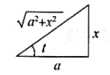

# 高等数学

## 函数、极限和连续
### 函数的概念和性质
1. 性质
   1. 有界性
   2. 奇偶性：
      - 奇函数 -> 定义域$D$关于原点对称, $f(-x)=-f(x)$
      - 偶函数 -> $f(x)=f(-x)$
        - 积分:
          - $f(x)$为奇函数, 则$\int_{-a}^a f(x)dx=0$
          - $f(x)$为偶函数, 则$\int_{-a}^a f(x)dx=2\int_0^af(x)dx$
   3. 周期性: 如$f(x+T)=f(x)$, 则函数f(x)是以$T$为周期的函数
   4. 单调性:
      1. 函数: 
         1. 当$f'(x) > 0 (<0)$时, 函数单调递增(减); 
         2. 当$f'(x) \geq 0 (\leq 0)$且等号有限个点处成立的话, $f(x)$单调递增(减)
      2. 数列: $X_{n+1}-X_n>0(<0)$, 数列单调递增(减)

2. 基本初等函数
   1. 幂函数$y=x^a(a \in \mathbb{R})$
   2. 指数函数$y=a^x(a是常数, 且a>0, a \ne 1)$
      | a的范围 | $a>1$ | $0<a<1$ |
      | :--------- | :-------: | ----------: |
      | 单调性 | 单调递增 | 单调递减 |
      | 奇偶性 | 非奇非偶 | 非奇非偶 |
      | 定义域 | $(-\infty, +\infty)$ | $(-\infty, +\infty)$ |
      | 值域 | $(0,+\infty)$ | $(0,+\infty)$ |
   3. 对数函数: $y=log_ax(a是常数, 且a>0, a \ne 1)$
      | a的范围 | $a>1$ | $0<a<1$ |
      | :--------- | :-------: | ----------: |
      | 单调性 | 单调递增 | 单调递减 |
      | 奇偶性 | 非奇非偶 | 非奇非偶 |
      | 定义域 | $(0,+\infty)$ | $(0,+\infty)$ |
      | 值域 | $(-\infty, +\infty)$ | $(-\infty, +\infty)$ |
   4. 三角函数:
      1. 正弦函数: $y=\sin x$
      2. 余弦函数: $y=\cos x$
      3. 正切函数: $y=\tan x$
      4. 余切函数: $y=\cot x$
      5. 正割函数: $y=\sec x= \frac{1}{\cos x}(偶函数, 周期T=2\pi)$
      6. 余割函数: $y=\csc x= \frac{1}{\sin x}(奇函数, 周期T=2\pi)$
   5. 反三角函数:
      1. 反正弦函数: $y=\arcsin x, y \in [-\frac{\pi}{2}, \frac{\pi}{2}]$
      2. 反余弦函数: $y=\arccos x, y \in [0, \pi]$
      3. 反正切函数: $y=\arctan x, y \in (-\frac{\pi}{2}, \frac{\pi}{2})$
      4. 反余切函数: $y=\arcctg x, y \in (0, \pi)$
---

### 极限的定义和性质
1. 极限的定义
   1. 数列极限: $\lim\limits_{n \to \infty} = A \iff \forall_\epsilon > 0 \exists N \in \mathbb{N}_+, 当n>N时, 有|x_n-A| < \epsilon$
   2. 函数极限: $\lim\limits_{n \to \infty} = A \iff \forall_\epsilon > 0 \exists X >0 , 当|x|>X时, 有|f(x)-A| < \epsilon$
   3. 函数极限: $\lim\limits_{n \to \infty} = A \iff \forall_\epsilon > 0 \exists \delta >0 , 当0 < |x-x_0|< \delta时, 有|f(x)-A| < \epsilon$
   - **注:**
      - 左极限 $\lim\limits_{x \to x_0^-} = A, 记为左极限f(x_0-0)=A$
      - 右极限 $\lim\limits_{x \to x_0^-} = A, 记为左极限f(x_0-0)=A$
      - 常见需区分左右极限的函数有:
      1. 指数函数: 
         $$ \lim\limits_{x \to \infty}e^x = +\infty, 
         \lim\limits_{x \to -\infty}e^x = 0, 
         \lim\limits_{x \to a^+}e^{\frac{1}{x-a}} = +\infty, 
         \lim\limits_{x \to a^-}e^{\frac{1}{x-a}} = 0$$
      2. 反正切函数:
         $$ \lim\limits_{x \to +\infty}\arctan x = \frac{\pi}{2},\lim\limits_{x \to -\infty}\arctan x = \frac{\pi}{2}$$  
         $$ \lim\limits_{x \to a^+}\arctan \frac{1}{x-a} = \frac{\pi}{2}, \lim\limits_{x \to a^-}\arctan \frac{1}{x-a} = -\frac{\pi}{2} $$      
      3. 绝对值函数: $\lim\limits_{x \to 0} \frac{|x|}{x}\left\{
         \begin{aligned}
        \lim\limits_{x \to 0^+} \frac{|x|}{x}=\lim\limits_{x \to 0^+} \frac{x}{x}=1, \\
         \lim\limits_{x \to 0^-} \frac{|x|}{x}=\lim\limits_{x \to 0^-} \frac{-x}{x}=-1
         \end{aligned}
         \right.$
      4. 取整函数: $\lim\limits_{x \to 0} [x] \left\{
         \begin{aligned}
         \lim\limits_{x \to 0^+} [x]=0, \\
         \lim\limits_{x \to 0^+} [x]=-1
         \end{aligned}
         \right.$
      5. 分段函数, 如$f(x)= \left\{
         \begin{aligned}
         f_1(x), x<a, \\
         f_2(x), x>a
         \end{aligned}
         \right.$  $f_1(x)\ne f_2(x)$
2. 函数极限性质
   1. 唯一性
   2. 局部有界性
   3. 局部保号性
3. 数列与子列的敛散性
   1. 若数列${x_n}$收敛于a(即$\lim\limits_{n \to \infty}x_n=a$), 则他的任一子列也收敛于a
   2. 
### 无穷小无穷大
1. 无穷小的运算
   1. 有限个无穷小的和差积仍是无穷小
   2. 有界变量与无穷小的乘积是无穷小
   3. 当 $x \to 0$, 有$o(x^m), o(x^n)分别为 x^m, x^n的高阶无穷小,且0<m<n$
      1. $o(x^m)\pm o(x^m) = o(x^m), o(x^m) \pm o(x^n) = o(x^m)$
      2. $x^m \cdot o(x^n) = o(x^{m+n}), 0(x^m) \cdot o(x^n) = o(x^m) $
2. 无穷小比阶
   1. 设两个函数$\alpha (x) 与 \beta (x)$满足$\lim\limits_{x \to \square} \alpha(x)= \lim\limits_{x \to \square} \beta(x)=0, 且\alpha(x) \neq 0$
      1. $\lim\limits_{x \to \square} \frac{\beta(x)}{\alpha(x)}=0, 称\beta(x)是比\alpha(x)高阶的无穷小, 记为\beta(x)=o(\alpha(x))$
      2. $\lim\limits_{x \to \square} \frac{\beta(x)}{\alpha(x)}=c(c\neq 0), 称\beta(x)和\alpha(x)是同阶无穷小$
         - **特别的:** , 若$\lim\limits_{x \to \square} \frac{\beta(x)}{\alpha(x)}=1, 称\beta(x)和\alpha(x)是等价无穷小$
      3. $\lim\limits_{x \to \square} \frac{\beta(x)}{\alpha(x)}=\infty, 称\beta(x)和\alpha(x)是低价无穷小$   
      4. $\lim\limits_{x \to \square} \frac{\beta(x)}{[\alpha(x)]^k}=c(c\neq 0, k>0), 称\beta(x)是关于\alpha(x)是低价无穷小$
3. 无穷小与无穷大
   1. 若$\lim\limits_{x \to \square}f(x)=\infty, 则\lim\limits_{x \to \square}\frac{1}{f(x)}=0$, 即无穷大的倒数为无穷小
   2. 若$\lim\limits_{x \to \square}f(x)=0, 且f(x)\ne 0, 则\lim\limits_{x \to \square}\frac{1}{f(x)}=\infty$, 即非零无穷小的倒数为无穷大
 --- 

### 极限运算
1. 四则运算
   1. 若$\lim\limits_{x \to \square}f(x)=A, \lim\limits_{x \to \square}g(x)=B(A,B \in \mathbb{R})$, 则:
      1. $\lim\limits_{x \to \square}[f(x)\pm g(x)]=f(x)\pm g(x)=A\pm B$
      2. $\lim\limits_{x \to \square}[f(x) \cdot g(x)]=\lim\limits_{x \to \square}f(x) \cdot \lim\limits_{x \to \square}g(x)=A\cdot B$
      3. $\lim\limits_{x \to \square}\frac{f(x)}{g(x)}=\frac{\lim\limits_{x \to \square}f(x)}{\lim\limits_{x \to \square}g(x)}=\frac{A}{B}$
2. "抓大头"思想
   1. $x \to 0$时, $x^{低}+x^{高} \sim x^{低}$
   2. 当x充分大时, $x^{低}+x^{高} \sim x^{高}$
   3. 当x充分大时, $(\ln x)^\beta < x^\alpha <e^{\gamma\alpha}$    
$$\lim\limits_{x \to \infty}\frac{a_m+x^m+a_{m-1}x^{m-1}+\cdots+a_1x+a_0}{b_nx^n+b_{n-1}x^{n-1}+\cdots+b_1x+b_0}= \left\{ \begin{array}{l} \infty, m>n \\ \frac{a_m}{a_n}, m=n, 其中a_mb_n \ne \\ a_3x + b_3y + c_3z = d_3\end{array}\right.$$
3. 常用等价无穷小替换
   - 当$x \to 0$时:
     - 等价于x的情况($\sim x$)：
       - $\sin x \sim \arcsin x \sim \tan x \sim \arctan x \sim e^x-1 \sim \ln(1+x) \sim  x$
     - 等价于$\alpha x$的情况($\sim \alpha x$):
       - $(1+x)^\alpha \sim \alpha x$
     - 等价于$\frac{1}{2}x^2$的情况($\sim \frac{1}{2}x^2$):
       - $1-\cos x \sim x-\ln(1+x) \sim \sec x-1 \sim e^x-1-x \sim \frac{1}{2}x^2$
     - 等价于$\frac{1}{6}x^3$的情况($\sim \frac{1}{6}x^3$):
       - $x-\sin x \sim \arcsin x -x \sim \frac{1}{6}x^3$
     - 等价于$\frac{1}{3}x^3$的情况($\sim \frac{1}{3}x^3$):
       - $\tan x - x \sim x-\arctan x \sim \frac{1}{3}x^3$
     - 等价于$\frac{1}{2}x^3$的情况($\sim \frac{1}{4}x^3$):
       - $\tan x - \sin x \sim \frac{1}{2}x^3$
4. 洛必达法则
   - 设：
      1. 当$x \to a$时, 函数$f(x)及g(x)$都趋于0
      2. 在点$a$的某去领域内, $f'(x), g'(x)$都存在, 且$g'(x) \ne 0$
      3. $\lim \limits_{x \to a}\frac{f'(x)}{g'(x)}$存在(或无穷大),则：
         1. $\lim \limits_{x \to a}\frac{f(x)}{g(x)} = \lim \limits_{x \to a}\frac{f'(x)}{g'(x)}$
   - 注：
     1. 当$x \to \infty$时, 相应条件下洛必达法仍成立
     2. $\frac{\infty}{\infty}$型:
        1. $\lim\limits_{x \to a} f(x) = \infty, \lim\limits_{x \to a} g(x) = \infty $
        2. 在点a的某去心领域内$f(x), g(x)$都可导
        3. $\lim \limits_{x \to a}\frac{f(x)}{g(x)}$ 存在(或无穷大), 则:
           1. $\lim \limits_{x \to a}\frac{f(x)}{g(x)} = \lim \limits_{x \to a}\frac{f'(x)}{g'(x)}$
        4. **注**: 数列不能使用洛必达法则(因为离散变量无法求导)
        5. $\frac{*}{\infty}$型"广义" 仍可以使用洛必达法则
5. 两个重要极限:
   1. $\lim\limits_{x \to 0} \frac{\sin x}{x}=1$
   2. $\lim\limits_{n \to \infty} (1+\frac{1}{n})^n = e$
   3. $\lim\limits_{x \to \infty} (1+\frac{1}{x})^\frac{1}{x} = e$
6. 常用泰勒公式(麦克劳林公式):
   - 当$x \to 0$时:
      - $e^x = 1 + x + \frac{x^2}{2!} + \cdots +\frac{x^n}{n!} + o(x^n)$
      - $\sin x = x - \frac{x^3}{3!} + \frac{x^5}{5!} - \cdots + (-1)^n \frac{x^{2n+1}}{(2n+1)!} + o(x^{2n+1})$
      - $\cos x = 1 - \frac{x^2}{2!} + \frac{x^4}{4!} - \cdots + (-1)^n \frac{x^{2n}}{(2n)!}+o(x^{2n})$
      - $\tan x = x + \frac{x^3}{3} + \frac{2x^5}{15} + \cdots + (-1)^{n-1} \frac{2^{2n}(2^{2n}-1)B_{2n}x^{2n-1}}{(2n)!} + o(x^{2n-1}), B_n$为第n个伯努利数
      - $\ln(1+x) = x - \frac{x^2}{2} + \frac{x^3}{3} - \cdots + (-1)^{n-1} \frac{x^{n}}{n} + o(x^{n})$
      - $\arctan x = x - \frac{x^3}{3} + \frac{x^5}{5} - \cdots + (-1)^{n} \frac{x^{2n+1}}{(2n+1)} + o(x^{2n+1})$
      - $\arcsin x = x + \frac{x^3}{6} + \frac{3x^5}{40} + \frac{5x^7}{112} + \frac{35x^9}{1152} + o(x^9) $
      - $\frac{1}{1-x} = 1 + x + x^2 + \cdots + x^n + o(x^n)$
      - $\frac{1}{1+x} = 1-x+x^2-\cdots +(-1)^nx^n + o(x^n)$
      - $(1+x)^\alpha=1+nx+\frac{\alpha(\alpha-1)}{2!}x^2+\cdots +\frac{\alpha(\alpha-1)\cdots(\alpha-n+1)}{n!}+o(x^n)$
7. 两个**重要准则**
   1. 夹逼定理
      1. 若**数列**${x_n},{y_n},{z_n}$满足条件:
         1. $\exists N \in \mathbb{N_+}时, 有x_n \leq y_n \leq z_n$
         2. $\lim\limits_{n \to \infty}x_n=\lim\limits_{n \to \infty}z_n=a$,则数列${y_n}的极限,\exist\lim\limits_{n \to \infty}y_n=a$
      2. 若**函数**$f(x),g(x),h(x)$满足条件:
         1. $\exists \delta >0, 当 0<|x-x_0|<\delta, 有g(x) \leq f(x) \leq h(x)$
         2. $\lim\limits_{x to x_0}g(x)= \lim\limits_{x to x_0}h(x)=A$, 则函数f(x)的极限存在, 且$\lim\limits_{x to x_0}f(x)=A(x \to \infty 时也类似)$
   2. 单调有界准则
   函数(或数列单调递增有上界, 或者单调递减有下界,  则极限必存在)
----
   
### 连续与间断
1. 连续
   1. 设函数$y=f(x)$, 若$\lim\limits_{x \to x_0}f(x)=f(x_0), 则称f(x)在点x_0处连续$
      1. 若$\lim\limits_{x \to x_0^-}f(x)=f(x_0), 则函数y=f(x)$在点$x_0$处左连续
      2. 若$\lim\limits_{x \to x_0^+}f(x)=f(x_0), 则函数y=f(x)$在点$x_0$处右连续
   2. 若在闭区间$[a,b]$和开区间$(a,b)$上连续, 且f(x)在左端点x=a处右连续, 右端点x=b处左连续
   3. 复合函数f(g(x)), $x=x_0$连续, $u=g(x),也在x_0处连续$, 则这个复合函数连续
2. 间断点
   1. 可去间断点: $\lim\limits_{x \to x_0^+}f(x)=\lim\limits_{x \to x_0^-}f(x)\ne f(x_0)$, $x_0$为可去间断点
   2. $x_0$跳跃间断点: $\lim\limits_{x \to x_0^+}f(x)=\lim\limits_{x \to x_0^-}f(x)$
   3. $x_0$无穷间断点: $\lim\limits_{x \to x_0^+}f(x)=\infty, \lim\limits_{x \to x_0^-}f(x)=\infty$
   4. 震荡断点: 如$y=\sin \frac{1}{x} 在x=0处是断点$ (无穷间断点和震荡断点属于第二类间断点)
---    

### 闭区间上连续函数的四个性质
1. 有界定理: 若连续,则必在区间上有界
2. 最值定理: 若连续,则**必有最大最小值**
3. 介值定理: 若$[a,b]$连续, $f(a) \ne f(b)$, c是介于函数的常数, 则$\xi \in (a,b)$, 使得$f(\xi)=c$
4. 零点定理: 若函数f(x)上连续, f(a)f(b)<0, 则必存在$x_0 \in (a,b)$使得$f(x_0)=0$
---

## 导数与微分
### 导数的定义几何意义
1. 导数的定义$$f'(x)=\lim\limits_{\Delta x \to 0}\frac{f(x+\Delta x)-f(x)}{\Delta x} = \lim\limits_{x \to x_0}\frac{f(x) -f(x_0)}{x-x_0}$$
2. 切线方程与法线方程
   1. 切线方程: $y-f(x_0)=f'(x_0)(x-x_0)$
   2. 法线方程: $y-f(x_0)=\frac-{1}{f'(x_0)}(x-x_0)(f'(x_0)\ne 0)$
3. 参考网站: <https://kb.kmath.cn/kbase/detail.aspx?id=285>
---

### 函数的求导法则和常见函数的导数
1. 导数的四则运算: 设$u(x), v(x)$可导,则:
   1. $[k_1u(x) \pm k_2v(x)]'=k_1u'(x)\pm k_2v'(x)$
   2. $[u(x)v(x)]'=u'(x)v(x)+u(x)v'(x)$
      1. 推导: $[u_1(x)u_2(x)\cdots u_n(x)]'=u_1'(x)u_2(x)\cdots u_n(x)+u_1(x)u_2'(x)\cdots u_n(x) + \cdots + u_1(x)u_2(x)\cdots u_n'(x)$
   3. $[\frac{u(x)}{v(x)}]'= \frac{u'(x)v(x)-u(x)v'(x)}{v^2(x)}(v(x)\ne 0)$

2. 常用导数公式
   1. $c'=0$
   2. $x^n{'}=ax^{a-1}$(a为常数)
   3. $\sin x'=\cos x$
   4. $\cos x'=-\sin x$
   5. $\tan x'=\sec ^2 x$
   6. $\cot x'=-\csc^2 x$
   7. $\sec x'=\sec x \tan x$
   8. $\csc x'=-\csc x \cot x$
   9. $\log_ax'=\frac{1}{x\ln a}'(a>0, a\ne 1)$
   10. $\ln x'=\frac{1}{x}$
   11. $a^x{'}=a^x \ln a(a>0, a\ne 1)$
   12. $e^x{'}=e^x$
   13. $\arcsin x'=\frac{1}{\sqrt{1-x^2}}$
   14. $\arccos x'=-\frac{1}{\sqrt{1-x^2}}$
   15. $\arctan x'=\frac{1}{1+x^2}$
   16. $\arcctg x'=-\frac{1}{1+x^2}$(也就是arccot)
   17. $[\ln(x+\sqrt{x^2\pm a^2})]'= \frac{1}{\sqrt{x^2\pm a^2}}$

3. 幂指函数求导:
   1. $[u(x)^{v(x)}]'=[e^{v(x)\ln u(x)}]'=e^{v(x)\ln u(x)} \cdot [v(x)\ln u(x)]'= u(x)^{v(x)} [v'(x)\ln u(x)+\frac{v(x)u'(x)}{u(x)}] (u(x)>0),且u(x) \ne 1$  
因式

4. 对数求导法(用于多个相乘的函数导数)
   1. 如$y=(x-x_1)^{m_1}(x-x_2)^{m_2}\cdots(x-x_n)^{m_n}$有:
      - $\ln|y|=m_1\ln|x-x_1|+\cdots+m_n\ln|x-x_n|$
      - 得: $\frac{y'}{y}=\frac{m_1}{x-x_1}+\cdots+\frac{m_n}{x-x_n}$
      - 有: $y'=\frac{m_1}{x-x_1}+\cdots+\frac{m_n}{x-x_n}y$

5. 复合函数求导
   - 设$y=f(u), u=g(x)$ ==> $y=f[g(x)]$, x处可导, 且有$\frac{dx}{dy}=\frac{dy}{du} \cdot \frac{du}{dx}=f'[g(x)]g'(x)$

   
6. 反函数求导
   - 设$y=f(x), x=g(y)$, $f'(x)=\frac{1}{g'(y)}, f''(x)=\frac{g''(y)}{[g'(y)]^3}$

  
7. 参数方程确定的函数求导
   - 若$y=y(x)$ 由 $\left\{\begin{array}{l} x= \varphi(t), \\ y = \psi (t) \end{array}\right.$确定，且$\varphi(t), \psi (t)$均二阶可导, 则:
     $$ \frac{dy}{dx}=\frac{dy/dt}{dx/dt}=\frac{\psi'(t)}{\varphi'(t)},$$
     $$ \frac{d^2y}{dx^2}=\frac{d(\frac{dy}{dx})/dt}{dx/dt}=\frac{[\frac{\psi'(t)}{\varphi'(t)}]'}{\varphi'(t)}=\frac{\psi''(t)\varphi'(t)-\psi'(t)\varphi''(t)}{[\varphi'(t)]^3}$$

8. 隐函数求导
9. 高阶导数
   1.  $(x^{\mu})^n=\mu(\mu-1)\cdots(\mu-n+1)x^{\mu-n}$, 特例:$(x^{\mu})^n=n!, (x^{n})^l=0 (l>n)$
   2.  $(a^x)^n = a^x(\ln a)^n$, 特例:$(e^x)^n=e^x$
   3.  $[\sin(kx+b)]^n = k^n \sin(kx +\frac{n \pi}{2}+b)$
   4.  $[\cos(kx+b)]^n = k^n \cos(kx +\frac{n \pi}{2}+b)$
   5.  $[\ln(ax+b)]^n = \frac{(-1)^{n-1}a^n(n-1)!}{(ax+b)^n}(n \geq 1)$
   6.  $(\frac{1}{ax+b})^n=\frac{(-1)^{n}a^nn!}{(ax+b)^{n+1}}$
   7.  莱布尼茨公式$(uv)^n= \sum\limits_{k=1}^{n} C_n^k u^{(n-k)}v^k$
---

## 微分(Differential)
1. 微分的定义
   1. 有定义域$x_0及x_0+\Delta x$, 若函数$y=f(x)$的增量$\Delta y=f(x_0+\Delta x)-f(x_0)
2. 微分的几何意义,如图:
   1. 
3. 微分的运算公式
   $$ dy =y'dx$$
4. 一元函数可微与可导(其实就是一个意思)
5. 可导与连续的关系
   1. 若$x_0$为可导点, 则$f(x_0)在x_0$上连续
   2. 若$x_0$左右导数存在, 则$f(x_0)在x_0$上连续
   3. 若$x_0$处连续, 则$f(x_0)在x_0$上不一定可导
   4. 若$x_0$处不连续, 则$f(x_0)在x_0$上一定不可导
--- 

### 微分中值定理与导数的应用
1. 中值定理
   1. 费马引理
   2. 罗尔定理
   3. 拉格朗日中值定理:
      1. $\frac{f(b)-f(a)}{b-a}=f'(\xi)$, 记$\xi=a+\theta(b-a)$, 则$\frac{f(b)-f(a)}{b-a}=f'(a+\theta(b-a))$, 其中$0<\theta<1$
   4. 柯西中值定理:
      1. $\frac{f(b)-f(a)}{F(b)-F(a)}=\frac{f'(\xi)}{F'(\xi)}$
   5. 泰勒中值定理
---
### . 导数的几何应用
   1. 单调性的判定
      1.在(a,b)区间可导, 如果恒有$f'(x) > 0(<0)$, 则有$f(x),在(a,b)$内单调增加(减少);如果恒有$f'(x) \ge 0(\le0), 则在(a,b)内单调不减(增)$
   2. 极值
      1. $x_0$在某邻域有定义, 有$f(x)<f(x_0) 或者f(x)>f(x_0) $, 则存在极大值(或极小值)
      2. 必要条件(可导情形):$x_0$为极值且f(x)可导,则$f'(x)=0$
      3. 充分条件
         1. $(x_0-\Delta,x_0),f'(x)>0$,而$(x_0,x_0+\Delta),f'(x)<0$，则f(x)在x0处有极大值
         2. $(x_0-\Delta,x_0),f'(x)<0$,而$(x_0,x_0+\Delta),f'(x)>0$，则f(x)在x0处有极小值
         3. 若$f'(x)$不变号,则没有极值
      4. 第二充分条件,$f'(x_0)=0, f''(x_0)\ne0'$
         1. 当$f''(x_0)<0$, 则有极大值
         2. 当$f''(x_0)>0$, 则有极小值
      5. 第三充要条件
         1. 若n阶可导, 则$x=x_0$是极值点
            1. 当$f''(x_0)>0$, $x=x_0$则有极小值
            2. 当$f''(x_0)<0$, $x=x_0$则有极大值
      6. 注:
         1. 一阶导数,用第一充分条件判断极值
         2. 二阶导数,用第二充分条件判断极值
         3. 以上条件均失效, 考虑用高阶导数判断
1. 最值
   1. f(x)在$I$上有定义(值域), $f(x)\le f(x_0) 或 f(x)\ge f(x_0)$, 则称$f(x_0)是函数$f(x)$在区间上的最大值或(最小值)
2. 凹凸性判断
   1. 设[a,b]连续,在(a,b)内二阶可导
      1. $f''(x)<0$, 则曲线在$[a,b]$是凸的
      2. $f''(x)>0$, 则曲线在$[a,b]$是凹的
3. 拐点
   1. 定义:曲线上凹弧和凸弧的分界点,就是拐点
   2. 必要条件,$f''(x_0)$存在, $f"(x_0)=0$
   3. 第一充分条件
      1. 连续,二阶可导,$f"(x_0)在x=x_0$处两侧异号,则$(x_0,f(x_0))$为拐点
   4. 第二充分条件
      1. $f"(x_0)=0, f"(x_0) \neq 0$, 则$(x_0,f(x_0))$为拐点
   5. 第三充分条件
      1. $f'(x_0)=f"(x_0)=f"'(x_0)=\cdots=f^{n-1}(x_0)=0, f^{n}(x_0) \not ={0}(n \ge 3)$, 则$(x_0,f(x_0))$为拐点
4. 渐近线
   1. 铅直渐近线 $x=a; \lim\limits_{x\to a+}f(x)=\infty 或\lim\limits_{x\to a-}f(x)=\infty$
   2. 水平渐近线 $y=c; \lim\limits_{x\to +\infty}f(x)=c 或\lim\limits_{x\to -\infty}f(x)=c$
   3. 斜渐近线 $y=kx+b; \lim\limits_{x\to \infty}\frac{f(x)}{x}=k \neq 0, \lim\limits_{x\to \infty}[f(x)-kx]=b$
   4. 斜渐近线和水平渐近线不能同时存在
5. 弧微分、曲率、曲率半径
   1. 弧微分: 设$y=f(x)$是平面内的光滑曲线, 则弧微分$ds=\sqrt{1+[f'(x)]^2}dx$
      - 若曲线方程为$\left\{\begin{array}{l} x=x(t), \\ y=y(t) \end{array}\right.$, 弧微分$ds=\sqrt{[x'(t)]^2+[y'(t)]^2}dt$
      - 若曲线方程: $r=r(\theta)$,弧微分$ds=\sqrt{[r'(\theta)]^2+[r'(\theta)]^2}d\theta$
   2. 曲率公式: $$k=\frac{|y"|}{[1+(y')^{2}]^{\frac{3}{2}}}$$
      1. 曲线$\left\{\begin{array}{l} x=x(t), \\ y=y(t) \end{array}\right.$上任意一点处的曲率为$K=\frac{|x"(t)y'(t)-x'(t)y"(t)|}{([x'(t)]^2+[y'(t)]^2)^{\frac{3}{2}}}$
   3. 曲率半径$R=\frac{1}{k}(k \neq 0)$
---

## 不定积分
### 原函数与不定积分
1. 原函数和不定积分的概念
  - 函数f(x)， 存在可导函数F(x)， 在x定义I上都能满足$F'(x)=f(x)$, 则称$F(x)$为$f(x)$的原函数
  - f(x)在区间$I$上的所有原函数集合称为,其在$I$区间上的不定积分, 记为$\int f(x)dx$, 则:
      $$ \int f(x)dx=F(x)+C$$ 
2. 连续函数一定有原函数,反之未必
---    

### 不定积分的性质与不缠功的不定积分公式
1. 不定积分性质
   1. $ \int F'(x)dx=F(x)+C$
   2. $[\int (f(x)dx)]'= (F(x)+C)'=f(x)$
   3. $[\int k_1f(x) \pm k_2g(x)]dx= k_1\int f(x)dx \pm k_2\int g(x)dx$ (就和乘法分配律一样)
2. 常用的不定积分
   1. $\int kdx = kx +C$
   2. $\int x^n dx=\frac{x^{n+1}}{n+1}+C, (n \neq -1)$
   3. $\int (ax+b)^n dx = \frac{(ax+b)^{n+1}}{a(n+1)}$
   4. $\int \frac{1}{x^2} = -\frac{1}{x}+C$
   5. $\int \frac{x}{1+x^2}dx=\frac{1}{2}\ln (1+x^2)+C$
   6. $\int \frac{1}{x}dx=\ln |x|+C$
   7. $\int \frac{x}{ax+b}dx=\frac{1}{a^2}(ax+b-b\ln|ax+b|)+C$
   8. $\int \frac{1}{x(ax+b)}dx=-\frac{1}{b}\ln|\frac{ax+b}{x}|+C$
   9. $\int \sin xdx=-\cos x+C$
   10. $\int \cos xdx=\sin x+C$
   11. $\int \sec^2xdx=\int \frac{1}{\cos^2 x}dx=tanx+C$
   12. $\int \csc^2xdx=-\cot x+C$
   13. $\int \tan x\sec xdx=\sec x+C$
   14. $\int \cot x\csc xdx=-\csc x+C$
   15. $\int \tan x dx= -\ln(|\cos x|) +C$
   16. $\int \cot xdx = \ln(|\sin x|)+C$
   17. $\int \sec xdx =\ln(\tan x + \sin x)+C$
   18. $\int \csc xdx=-\ln(|\csc x| - \cot x)+C$
   19. $\int \sin^2 xdx=\frac{x}{2}-\frac{\sin2x}{4}+C$
   20. $\int \cos^2 xdx=\frac{x}{2}+\frac{\sin2x}{4}+C$
   21. $\int \tan^2 xdx=\tan x -x+C$
   22. $\int \cot^2 xdx =-\cot x -x +C$
   23. $\int a^xdx=\frac{a^x}{ln a}+C$
   24. $\int e^x dx=e^x+C$
   25. $\int \frac{dx}{\sqrt{a^2-x^2}}=\arcsin \frac{x}{a}+C$
   26. $\int \frac{dx}{a^2+x^2}=\frac{1}{a}\arctan\frac{x}{a}+C$
   27. $\int \frac{dx}{a^2-x^2}=\frac{1}{2a}\ln \frac{|x+a|}{|x-a|}+C$
   28. $\int \frac{dx}{\sqrt{x^2+a^2}} = \ln|x+\sqrt{x^2+a^2}|+C$
   29. $\int \frac{dx}{\sqrt{x^2-a^2}} = \ln|x+\sqrt{x^2-a^2}|+C, (|x|>|a|)$
   30. $\int \sqrt{a^2-x^2}dx=\frac{a^2}{2}\arcsin\frac{x}{a}+\frac{x}{a}\sqrt{a^2-x^2}+C$
   31. $\int \frac{x^2}{\sqrt{ax+b}}dx = \frac{2}{15a^3}(3a^2x^2-4abx+8b^2)\sqrt{ax+b}+C$
--- 

### 不定积分的计算
1. 第一换元法（凑微分）
   - 设$\int f(u)du=F(u)+C, \varphi(x)$可导,则: $$ \int f[\varphi(x)]\varphi'(x)dx=\int f[\varphi(x)]d[\varphi(x)]=F[\varphi(x)]+C$$
2. 第二换元法
   - 设$x=\varphi$可导, 且$\varphi'(t) \neq 0, 若\int f[\varphi(t)] \varphi'(t)dt = G(t)+C$,则 $$ \int f(x)dx \underleftrightarrow{x=\varphi(t)} \int f[\varphi(t)]\varphi'(t)dt=G(t)+C=G[\varphi^{-1}(x)]+C$$
     
     |--|--|--|
     | :--------- | :-------: | ----------: |
     |$\sqrt{a^2-x^2}$|令$x=a\sin t$|  |  
     |$\sqrt{a^2+x^2}$|令$x=a\tan t$|  |    
     |$\sqrt{x^2-a^2}$|令$x=a\sec t$|  |
     |$\sqrt[n]{ax+b}$|令$\sqrt[n]{ax+b}=t$| $x=\frac{t^n-b}{a}$} |  
   **注**:
     - 若分母幂比分子幂高2次以上,可以代换$\frac{1}{x}=t$
     - 积分结果要将t换回原来的积分变量
3. 分部积分法
   1. 设$u(x),v(x)$均有连续的导数, 则$\int u(x)d[v(x)]=u(x)v(x)-\int v(x)d[u(x)]$
4. 有理函数积分
   1. 有多项式$P_n(x),Q_m(x), 则\int \frac{P_n(x)}{Q_m(x)}dx$为有理函数积分,有n和m为**真分式**, 否则为**假分式**
--- 

## 定积分
### 定积分的概念和性质
1. 定积分的概念
   1. 定积分是把函数$f(x)$在区间$[a,b]$上积分, 得到的值,记为$\int_a^b f(x)dx$
   2. $\int_a^bf(x)dx = \lim\limits_{n\to \infty}\sum\limits_{i=1}^n f[a+\frac{(b-a)i}{n}]\frac{b-a}{n}$
   3. $\int_0^1f(x)dx= \lim\limits_{n\to \infty}\sum\limits_{i=1^n}f(\frac{i}{n})=\lim\limits_{n \to \infty}\sum \limits{i=0}^{n-1} f(\frac{2i+1}{2n})$
2. 可积的充要条件:
   1. 充分条件:
      1. f(x)在[a,b]上连续
      2. f(x)在[a,b]上有界,且有有限个间断点
   2. 必要条件
      1. 在[a,b]上有界(有界函数不一定可积)
3. 定积分几何意义
   1. 表示曲线f(x)和直线x=a,x=b以及x轴所围成图形面积的代数和. 
      1. x轴上方取正值
      2. x轴下方取负值
4. 定积分性质
   1. $\int_a^b[k_1f(x) \pm k_2g(x)]dx=k_1\int_a^bf(x)dx \pm k_2\int_a^bg(x)dx$k1k2为常数
   2. $\int_a^b f(x)dx=\int_a^c f(x)dx+\int_c^b f(x)dx$
   3. $\int_a^b 1dx=b-a$
   4. (定积分的保号性)若区间[a,b]有$f(x) \geq 0, 则\int_b^af(x)\geq 0$ 
      1. 推论1: 若$f(x) \geq g(x)$, 则$\int_a^b f(x)dx \geq \int_a^b {g(x)}dx$
      2. 推论2: $f(x) \geq 0$,其中等号只在有限个点上,则$\int_a^bf(x)dx\geq 0$
      3. 推论3: f(x),g(x)在区间上连续,$f(x) \geq g(x)$,则:$$\int_a^bf(x)dx > \int g(x)dx$$
      4. 推论4: $|\int_a^b f(x)dx| \leq \int_a^b |f(x)|dx, a<b$
      5. 设M和m分别是函数f(x)在区间[a,b]上的最大值和最小值,则:$$ m(a-b)\leq \int_a^b f(x)dx \leq M(b-a)$$
      6. (积分第一中值定理)设f(x)g(x)在[a,b]上连续, g(x)在此区间不变号,则至少存在一点$\xi \in [a,b], 有\int_a^b f(x)g(x)dx=f(\xi)\int_a^bg(x)dx$
         1. 若g(x)=1, 则$\int_a^b f(x)dx=f(\xi)(b-a)$
         2. $f(\xi)=\frac{\int_a^b f(x)dx}{b-a}$的平均值
---  
### 微积分基本公式
1. 牛顿-莱布尼茨公式
   1. 设f(x)在区间上可积,F(x)为原函数,则有:$$\int_a^b f(x)dx=F(x) |_a^b=F(b)-F(a)$$
   2. 变限积分函数
      1. 定义: f(x)在区间上可积, 则$F(x)=\int_a^x f(t)dt, x\in[a,b],$称为变上限积分函数
      2. 性质:
         1. f(x)可积, 则$F(x)=\int_a^x f(t)dt$在[a,b]上连续
         2. 若f(x)连续,则$F(x)=\int_a^x f(t)dt$在[a,b]上可导, $F'(x)=f(x)$
         3. $F(x)=\int_{\varphi_1^{(x)}}^{\varphi_2^{(x)}}f(t)dt,\varphi_1(x)和\varphi_2(x)可导,f(x)连续$,则: $$ F'(x)=f[\varphi_2(x)]\varphi_2'(x)-f[\varphi_1(x)]\varphi_1'(x)$
            1. 注:若区间为$[a,x_0)\cup(x_0,b]$, 也就是在x=x0出间断
               1. 若点$x=x_0$为可去间断点, 则$F'(x_0)=\lim\limits_{x \to x_0}f(x)$
               2. 若为条约间断点, 则$F'(x_0)$不存在
--- 

### 定积分计算
1. 换元法
   1. 函数在区间连续, 函数$x=\varphi(t)$满足以下两个条件:
      1. $\varphi(\alpha)=a, \varphi(\beta)=b, 且当t \in [\alpha,\beta]或[\beta,\alpha]$时, 有a\leq\varphi(t)\leq b$
      2. $x=\varphi(t)$且在区间上连续, 则: $$\int_a^b f(x)dx\underleftrightarrow{x=\varphi(t)}\int_{\alpha}^{\beta} f(\varphi(t))\varphi'(t)dt=$$
2. 分部积分法 $$\int_a^b udv=uv |_a^b - \int_a^b vdu$$
3. 区间再现公式 $$\int_a^bf(x)dx=\int_a^b f(a+b-x)dx$$
4. 定积分几何意义
   1. 在区间上非负,则定积分表示由曲线y=f(x),x轴,直线x=a,x=b所围图形的面积
   2. 在区间上变号,则定积分表示由曲线y=f(x),x轴,直线x=a,x=b所围x轴上方图形减去x轴下方图形面积所得之差.
      1. 例: $$\int_{-R}^R \sqrt{R^2-x^2}dx=\frac{\piR^2}{2}$
5. 对称区间上的定积分$$ \int_{-a}^a f(x)dx=\int_0^a[f(x)+f(-x)]dx=\left\{\begin{array}
   2\int_0^a f(x)dx & f(x)=f(-x)\\
   0, f(x)=-f(-x) 
\end{array}
\right.$$

### 反常积分

## 定积分应用

### 平面图形的面积

### 旋转体的体积

### 平面曲线的弧长

### 旋转曲面的表面积

### 曲线质量

### 曲线质心

## 微分方程
### 一阶微分方程

### 可降阶的微分方程及其解法

### 高阶线性微分方程的结构

### 常系数线性微分方程

### 欧拉方程

### 全微分方程

## 向量代数与空间解析几何
### 向量代数

### 平面与直线方程

### 空间曲面

### 空间曲线

## 多元函数微分学
### 多元函数的基本概念

### (偏)导数的计算

### 极值

### 多元函数微分学的几何应用

### 方向导数与梯度

## 二重积分
### 二重积分的概念和性质

### 二重积分的计算

### 二重积分的应用

## 无穷级数
### 常数项级数的概念与性质

### 正项级数

### 绝对收敛和条件收敛

### 交错级数

### 幂级数

### 泰勒级数

### 傅里叶级数

## 三重积分与曲线曲面积分
### 三重积分

### 三重积分的应用

### 第一类曲线积分

### 第二类曲线积分

### 第一类曲面积分

### 第二类曲面积分

### 曲线曲面积分的几何应用(曲线的弧长,曲面的面积与柱面的表面积)

