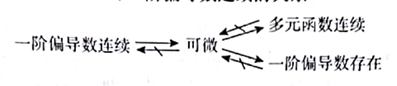

# 高等数学第二部分

## 多元函数微分学
### 1. 多元函数的基本概念
1. 多元函数的极限
$$\lim\limits_{(x,y)\to(x_0,y_0)}f(x,y)=A \iff \forall \epsilon>0, \exists \delta>0, 当0<\sqrt{(x-x_0)^2+(y-y_0)^2}<\delta $$,有
$$|f(x,y)-A|<\epsilon $$
2. 多元函数的连续性
3. 多元函数再有界闭区域上的性质
   1. 如有界,则有大小值
4. 一阶偏导数
   1. 设函数$z=f(x,y),在点(x_0,y_0)$上的某领域有定义,若极限: 
   $$ \lim\limits_{\Delta x \to 0}\frac{f(x_0+\Delta x,y_0)-f(x_0,y_0)}{\Delta x}$$
   存在, 则称此极限为z=f(x,y)在点(x_0,y_0)处对x的偏导数,记作:
   $$ f_x'(x_0,y_0)=\lim\limits_{\Delta x \to 0}\frac{f(x_0+\Delta x,y_0)-f(x_0,y_0)}{\Delta x}$$
   类似有$f_x'(x_0,y_0)=\lim\limits_{\Delta y \to 0}\frac{f(x_0,y_0+\Delta y)-f(x_0,y_0)}{\Delta y}$
5. 多元函数连续、一阶偏导数存在、可微与一阶偏导数连续的关系

1. 二阶偏导数
   - 若 z=f(x,y) 有连续的二阶偏导数，则$f"_{xy}(x,y)=f"_{yx}(x,y)$

--- 
### 2. (偏)导数的计算
1. 多元复合一元
   1. 设函数z=f(x,y),并在此点处的偏导数连续，其中x=x(t),y=y(t)可微， 此时z是t的一元函数$z=f(x(t),y(t))$ 则:
   $$\frac{dz}{dt}=z'(t)=\frac{\partial f}{\partial x}\cdot \frac{\partial x}{\partial t}+\frac{\partial f}{\partial y} \cdot \frac{\partial y}{\partial t}= f'_1x'(t)+f'_2y'(t)$$
   特别地, 若y是x的可导函数y=y(x), 则z=f[x,y(x)]:
   $$\frac{dz}{dx}=z'(x)=\frac{\partial f}{\partial x}\cdot \frac{\partial x}{\partial x}+\frac{\partial f}{\partial y} \cdot \frac{\partial y}{\partial x}= f'_1+f'_2y'(x)$$
   2. 多元复合多元
      1. z为x,y的二元函数z=f[u(x,y),v(x,y)],故:
      $$\frac{dz}{dx}=\frac{\partial f}{\partial u}\cdot \frac{\partial u}{\partial x}+\frac{\partial f}{\partial v} \cdot \frac{\partial v}{\partial y}= f'_1u'_x+f'_2v'_x$$
      $$\frac{dz}{dy}=\frac{\partial f}{\partial u}\cdot \frac{\partial u}{\partial y}+\frac{\partial f}{\partial v} \cdot \frac{\partial v}{\partial y}= f'_1u'_x+f'_2v'_y$$
      - 若u是x的可导函数,则:
      $$\frac{dz}{dx}=\frac{\partial f}{\partial u}\cdot \frac{\partial u}{\partial x}+\frac{\partial f}{\partial v} \cdot \frac{\partial v}{\partial y}= f'_1u'+f'_2v'_x$$
      $$\frac{dz}{dy}=\frac{\partial f}{\partial v}\cdot \frac{\partial v}{\partial y}=f'_2v'_y$$
   3. 一元复合多元
      1. 设函数z=f(u),z是x,y的二运函数f[u(x,y)],有:
      $$ \frac{dz}{dx}=\frac{\partial f}{\partial u}\cdot \frac{\partial u}{\partial x}=f'(u)u'_x, \frac{dz}{dy}=\frac{\partial f}{\partial u}\cdot \frac{\partial u}{\partial y}=f'(u)u'_y$$
2. 隐函数
   1. 一元隐函数
      1. 若$F(x,y)在(x_0,y_0)$的某邻域内有一阶段连续偏导数, 且$F(x_0,y_0)=0, F'_y(x_0,y_0) \neq 0$，则方程$F(x,y)=0$在点(x_0,y_0)的该领域内可唯一确定一个具有连续导数的函数y=y(x), 满足$y_0=y(x_0), 有\frac{dy}{dx}=-\frac{F'_x}{F'_y}$
         1. $F'_x,F'_y$是二元函数$F(x,y)$对x,y的偏导数

   2. 二元隐函数
      1. 若$F(x,y,z)在(x_0,y_0,z_0)$的某邻域内有一阶段连续偏导数,且$F(x_0,y_0,z_0)=0, F'_y(x_0,y_0,z_0) \neq 0$则方程$F(x,y,z)=0$在点(x_0,y_0,z_0), 是唯一确定一个具有连续偏导数的二元函数$z=f(x,y), 满足z_0=f(x_0,y_0), 有\frac{\partial z}{\partial x}=-\frac{F'_x}{F'_z},\frac{\partial z}{\partial y}=-\frac{F'_y}{F'_z}$
   3. 已知由方程组$\left\{\begin{array}{l} F(x,y,u,v)=0 \\ G(x,y,u,v)=0 \end{array}\right.$, 确定隐函数$\left\{\begin{array}{l} u=u(x,y) \\ v=v(x,y) \end{array}\right.$对方程组关于x求偏导,有:
   $$\left\{\begin{array}{l} F'_x+F'uu'_x+F'_vv'_x=0, \\ G'_x+G'uu'_x+G'_vv'_x=0 \end{array}\right.$$
---       
### 3. 极值
1. 定义: $f(x,y)>f(x_0,y_0)(f(x,y)<f(x_0,y_0)$
  - 则$x_0,y_0$为z=f(x,y)的极小(大)值点, $f(x_0,y_0)$为z=f(x,y)的极小(大)值点
2. 极值存在的必要条件
  - 若在函数z中有$(x_0,y_0)$处取极值, 且该点偏导数存在,则:
  $$ _x(x_0,y_0)=0,f'_y(x_0,y_0)=0$$
  - 则$(x_0,y_0)$为函数的极小(大)值点
3. 极值存在的充分条件
  - 在函数z中有$(x_0,y_0)$的某领域有连续的一阶及二阶偏导数,有$f'_x(x_0,y_0)=0,f'_y(x_0,y_0)=0$,令$A=f"_{xx}(x_0,y_0), B=f"_{xy}(x_0,y_0), C=f"_{yy}(x_0,y_0)$$,则:
  1. 若$AC-B^2>0$,则$(x_0,y_0)$为函数的极值点
      1. 当A>0时为极小值,A<0时为极大值
  2. 若$AC-B^2=0$,则不能确定$(x_0,y_0)$是否为函数的极值点
  3. 若$AC-B^2<0$,则$(x_0,y_0)$不是极值点
4. 条件极值
   1. 其中约束条件$\varphi(x,y)=0$, 可由拉格朗日乘法求解, 步骤如下:
      1. 构造拉格朗日函数$L=f(x,y)+\lambda\varphi(x,y)$其中$\lambda$为参数
      2. 求偏导,并令偏导数为0,即
      $$\left\{\begin{array}{l} 
      L'_x=f'_x(x,y)+\lambda\varphi'_x(x,y)=0 \\ 
      L'_y=f'_y(x,y)+\lambda\varphi'_y(x,y)=0 \\
      L'_\lambda=\varphi(x,y)=0
      \end{array}
      \right.$$
   3. 接上述方程组得若干个驻点,将驻点分别代入目标函数,求最值
若目标函数为u=(x,y,z),则有两个约束条件$\varphi(x,y,z)=0, \psi(x,y,z)=0$, 构造拉格朗日参数,解题步骤同上
***
### 4. 多元函数微分学的几何应用
1. 空间曲线的切线与法平面
   1. 设空间线$\left\{\begin{array}{l} x=x(t), \\ y=y(t), \\ z=z(t) \end{array}\right.$, 其皆可导, 曲线上有任意点$P(x_0,y_0,z_0)$对应$t=t_0$, 且$x'(t_0),y'(t_0),z'(t_0)$不同时为0, 则曲线在点$P(x_0,y_0,z_0)$,处的切线方程$\frac{x-x_0}{x'(t_0)}+\frac{y-y_0}{y'(t_0)}+\frac{z-z_0}{z'(t_0)} =0$
      1. 法平面方程: $x'(t_0)(x-x_0)+y'(t_0)(y-y_0)+z'(t_0)(z-z_0)=0$
   2. 若$\left\{\begin{array}{l} x=x, \\ y=y(x), \\ z=z(x) \end{array}\right.$, 均可导,切线方程$\frac{x-x_0}{1}+\frac{y-y_0}{y'(x_0)}+\frac{z-z_0}{z'(x_0)} =0$
      1. 法平面方程:$x-x_0+y'(x_0)(y-y_0)+z'(x_0)(z-z_0)=0$
   3. 若曲线方程由隐函数$\left\{\begin{array}{l} F(x,y,z)=0, \\ G(x,y,z)=0 \end{array}\right.$, 可求出$y'(x_0),z'(x_0)$. 代入上述方程与法平面方程即可

2. 空间曲面的切平面与法线
   1. 曲面方程为$F(x,y,z)=0$, 曲面上任意点$P(x_0,y_0,z_0)$, 则切平面方程:
      $$F'_x(x_0,y_0,z_0)(x-x_0)+F'_y(x_0,y_0,z_0)(y-y_0)+F'_z(x_0,y_0,z_0)(z-z_0)=0$$
      切平面的法向量:$n=(F'_x(x_0,y_0,z_0),F'_y(x_0,y_0,z_0),F'_z(x_0,y_0,z_0))$
      法线方程:$\frac{x-x_0}{F'_x(x_0,y_0,z_0)}+\frac{y-y_0}{F'_y(x_0,y_0,z_0)}+\frac{z-z_0}{F'_z(x_0,y_0,z_0)} =0$
   2. 若曲面方程为z=f(x,y), 则切平面方程为$F_x(x,y,z)=f(x,y)-z, 有F'_x=f'_x, F'_y=f'_y, F'_z=-1$, 将$F'_x,F'_y,F'_z$代入切平面方程,即可得切平面方程
--- 

### 5. 方向导数与梯度
1. 方向导数
   1.定义,有函数和点其沿方向$l=(\cos \alpha,\cos \beta) 的方向导数为:
   $$\frac{\partial f}{\partial l_1}|_{(x_0,y_0)}=\lim\limits_{t \to 0+} \frac{f(x_0+t\cos \alpha,y_0+t\cos \beta)-f(x_0,y_0)}{t}$
      - 其中$\alpha, \beta$为射线l与x轴,y轴正半轴的夹角
   1. 计算
      1. 若函数在某点出可微,则函数在该店沿任意方向$l$的方向导数均存在,且有:
      $$ \frac{\partial f}{\partial l_1}|_{(x_0,y_0)}=f'_x(x_0,y_0)\cos \alpha,f'_y(x_0,y_0)\cos \beta)$$
   - 其中$\cos \alpha, \cos \beta$为$l$的方向余弦
   - 同理可得,三元可微函数u=(x,y,z)在点$P(x_0,y_0,z_0)$
2. 梯度
   1. 若函数z=f(x,y)有一阶连续偏导数, 称向量$(f'_x(x_0,y_0),f'_y(x_0,y_0))$为此函数在点$(x_0,y_0)处的梯度, 记为$grad f(x_0,y_0)=(f'_x(x_0,y_0),f'_y(x_0,y_0))$
   2. 同理三元函数u=(x,y,z)在点$(x_0,y_0,z_0)$处为$grad u(x_0,y_0,z_0)=(u'_x(x_0,y_0,z_0),u'_y(x_0,y_0,z_0),u'_z(x_0,y_0,z_0))$
---

## 二重积分
### 1. 二重积分的概念和性质
1. 定义
   $$ \iint\limits_D f(x,y) d\sigma = \lim\limits_{\lambda \to 0}\sum_{i=1}^n f(\xi_i, \eta_i)$$
   其可用于求数列极限
2. 几何意义
   - 若$(x,y)\in D, z=f(x,y)$，则$\iint_D f(x,y) d\sigma$, 表示以区域D为底, 高为z=f(x,y)的曲顶柱体的体积
3. 性质
   1. $\iint\limits_D[k_1f(x,y)+k_2g(x,y)]dxdy=k_1\iint\limits_D f(x,y)dxdy+k_2\iint\limits_D g(x,y)dxdy,(k_1,k_2\in\mathbb{C})$
   2. $\int\limits_D f(x,y)dxdy=\iint\limits_{D_1} f(x,y)dxdy+\iint\limits_{D_2} f(x,y)dxdy (D=D_1+D_2, D_1\cap D_2=\emptyset)$
   3. 若$(x,y)\in D$, 有f(x,y)=1, 则$\iint\limits_D f(x,y)dxdy=\iint\limits_D 1dxdy=S_D(S_D为有界闭区域D的面积)$
   4. 若f(x,y),g(x,y)在D上连续,且$f(x,y)\geq g(x,y)$,则:
   $$ \iint\limits_D f(x,y)dxdy\geq \iint\limits_D g(x,y)dxdy $$
   - 若等号仅在有限条线上成立,则称$\iint\limits_D f(x,y)dxdy > \iint\limits_D g(x,y)dxdy.$
   $$ \iint\limits_D |f(x,y)|dxdy\geq |\iint\limits_D g(x,y)dxdy|$$
   1. 若函数在有界闭区域D上连续,有$m \leq f(x,y) \leq M, S_D为区域D的面积$,则:
   $$ mS_D=\iint\limits_D mdxdy \leq \iint\limits_D f(x,y)dxdy \leq \iint\limits_D MS_D $$
   2. **(二重积分的中心定理)**若函数在 有界区域D上连续,S_D为区域D的面积,则$\exist(\xi,\eta)\in D$ 有:
   $$ \iint\limits_D f(x,y)dxdy=f (\xi,\eta)S_D$$
---

### 2. 二重积分的计算
1. 直角坐标系下计算二重积分
   1. X型区域
      1. 设积分区域$D=\{(x,y)|\varphi_1(x)\leq y\leq \varphi_2(x),a\leq x\leq b\}$ 
   
      - 则: $\iint\limits_D f(x,y)dxdy=\int_a^b\int_{\varphi_1(x)}^{\varphi_2(x)}f(x,y)dy$
   2. Y型区域
      1. 设积分区域$D=\{(x,y)|\psi_1(y)\leq x\leq \psi_2(y),c\leq y\leq d\}$
   
      - 则: $\iint\limits_D f(x,y)dxdy=\int_c^d\int_{\psi_1(y)}^{\psi_2(y)}f(x,y)dx$
   3. 二重积分的就行与轮换对称性
      1. 积分区域D关于x轴对称,记x轴上方部分为$D_1$,则:
      $$ \iint\limits_D f(x,y)dxdy=\left\{\begin{array}{l} 0, f(x,y)=-f(x,-y), \\ 2\iint_{D_1}f(x,y)dxdy, f(x,y)=f(x,-y)\end{array}\right.$$
      2. 积分区域D关于x轴对称,记x轴上方部分为$D_2$,则:
      $$ \iint\limits_D f(x,y)dxdy=\left\{\begin{array}{l} 0, f(x,y)=-f(-x,y), \\ 2\iint_{D_2}f(x,y)dxdy, f(x,y)=f(-x,y)\end{array}\right.$$
      3. 关于直线y=x对称,有
      $$\iint\limits_D f(x,y)dxdy=\iint\limits_Df(y,x)dxdy=\frac{1}{2}\iint\limits_D[f(x,y)+f(y,x)]dxdy$$

   4. 形心公式
      1. 若$(\bar{x}, \bar{y})$为平面区域D的形心坐标,区域D的面积为$S_D$, 则:
      $$ \iint\limits_D x dxdy=\bar{x}S_D,\int_{-\infty}^{\infty}y dt=\bar{y}S_D$$
      - 注: 常见图形的形心:
        1. 圆的形心为圆心
        2. 矩形的形心为对角线交点
        3. 三角形的形心为三个顶点的算术平均值
        4. 对称图形的形心在对称轴上
---

2. 极坐标系下计算二重积分
   直角坐标系与极坐标系之间的转换公式:$\iint\limits_D f(x,y)dxdy=\left\{\begin{array}{l} x=r\cos \theta, \\ y=r\sin \theta, \\ dxdy=rdrd\theta=d\sigma f(x,y)=f(-x,y)\end{array}\right.$
   $$ \iint\limits_D f(x,y)dxdy=\iint\limits_D f(r\cos \theta,r\sin \theta)rdrd\theta$$
   - $极角\theta \in [0,2\pi]或[-\pi,\pi]$
   - 极径$r$:$r 平面任意(x,y)一点到极点的举例 $r\sqrt{x^2+y^2}$
   1. 极坐标的三种常见区域
      1. 极点(坐标原点)在积分区域外
         1. 
         2. 其中$D={(r,\theta)|\alpha \leq \theta \leq \beta, r_1(\theta) \leq r \leq r_2(\theta)}$
         $$ \iint\limits_D f(r\cos \theta,r\sin \theta)rdrd\theta =\int_{\alpha}^{\beta}d\theta\int_{r_1(\theta)}^{r_2(\theta)}f(r\cos \theta,r\sin \theta)rdr$$
      2. 极点在积分区域边界上
         1. 
         2. 其中$D={(r,\theta)|\alpha \leq r \leq \beta,0 \leq r \leq r(\theta)}$, 有:
         $$ \iint\limits_D f(r\cos \theta,r\sin \theta)rdrd\theta =\int_{\alpha}^{\beta}d\theta\int_{0}^{r(\theta)}f(r\cos \theta,r\sin \theta)rdr$$
      3. 极点在积分区域内部
         1. 
         2. 其中$D={(r,\theta)|\alpha \leq \theta \leq 2\pi,0 \leq r \leq r(\theta)}$, 有:
         $$ \iint\limits_D f(r\cos \theta,r\sin \theta)rdrd\theta =\int_{0}^{2\pi}d\theta\int_{0}^{r(\theta)}f(r\cos \theta,r\sin \theta)rdr$$
   2. 平移变换
      1. 对二重积分$\iint\limits_D f(x,y)dxdy$进行平移变换, 即$x\rightarrow u-a, y\rightarrow v-b, 将xOy$坐标系的二重积分,变为$uOv$坐标系的二重积分, 即$\iint\limits_{D'} f(u-a,v-b)dudv$ (其中区域D'为$D$的平移变换后得到的区域)
   3. 直角坐标系下和极坐标系下**计算二重积分的过程**:
      1. 确定积分区域;
      2. 化简积分表达式(奇偶性+轮换对称性)
      3. 由积分区域与被积函数确定直角坐标或
      4. **对于直角坐标系**,确定积分次序,(分块)计算二重积分;**对于极坐标系**,分别确定*极角*与*极径*
---

### 3. 二重积分的应用
   | 几何/物理量 | 表达式                                                                                                                                                               |
   | :---------: | -------------------------------------------------------------------------------------------------------------------------------------------------------------------- |
   |    面积     | $S=\iint\limits_D 1d\sigma$                                                                                                                                          |
   |    体积     | $V=\iint\limits_D \lvert f(x,y)\rvert d\sigma$   |
   |    质量     | $m=\iint\limits_D \rho(x,y)d\sigma$                                                                                                                                  |
   |    质心     | $\bar{x}=\frac{\iint\limits_D x\rho(x,y)d\sigma}{\iint\limits_D \rho(x,y)d\sigma}, \bar{y}=\frac{\iint\limits_D y\rho(x,y)d\sigma}{\iint\limits_D \rho(x,y)d\sigma}$ |
   |  转动质量   | 对x轴: $\iint\limits_D y^2\rho(x,y)d\sigma$ 对 y轴: $\iint\limits_D x^2\rho(x,y)d\sigma$ 对原点: $\iint\limits_D (x^2+y^2)\rho(x,y)d\sigma$                                                                                                                                                             |
 ----

## 无穷级数
### 1. 常数项级数的概念与性质
1. 定义
   1. 数列${u_n} \rightarrow u_1+u_2+\cdots + u_n \iff \sum_{n=1}^{\infty}u_n$, $u_n$被称为此sum的通项
2. 发散与收敛
   1. 级数$\sum_{n=1}^{\infty}u_n的部分 和 S_n=u_1+u_2+\cdots + u_n$, 若部分和数列{$S_n$}收敛, 即极限$\sum_{n=1}^{\infty}S_n$**存在**, 则称$\sum_{n=1}^{\infty}u_n$收敛; 若$\sum_{n=1}^{\infty}S_n$**不存在**否则级数发散
3. 性质
   1. 若$k \neq 0$,则$\sum_{n=1}^{\infty}u_n$和$\sum_{n=1}^{\infty}ku_n$同时收敛或发散
   2. 级数$\sum_{n=1}^{\infty}u_n, \sum_{n=1}^{\infty}v_n$都收敛, 则$\sum_{n=1}^{\infty}(u_n \pm v_n)$收敛
      1. 推: u_n级数收敛,v_n级数发散,则他俩的和或差级数也发散
      2. 推: 这俩记住发散,则敛散性未知
   3. 有限项k不能改变敛散性
   4. 级数收敛的必要条件 ---> 若级数$\sum_{n=1}^{\infty}u_n$收敛,则$\lim_{n \to \infty}u_n=0$
---

### 2. 正项级数
1. 定义
   1. 通向$u_n \ge 0, n=1,2,...$, 则级数U_n为正项级数
2. 判断敛散性
   1. 定理1: 充要条件: $\sum_{n=1}^{\infty}u_n$收敛的充要条件为部分和数列{S_n}有上界
   2. 定理2: (比较判别法): 有正项级数$\sum_{n=1}^{\infty}u_n, sum_{n=1}^{\infty}v_n$, 若$\exist N, 当n \geq N时, 有u_n \geq v_n$, 若$\sum_{n=1}^{\infty}u_n$收敛,则$\sum_{n=1}^{\infty}v_n$收敛; 若$\sum_{n=1}^{\infty}v_n$发散,则$\sum_{n=1}^{\infty}u_n$发散
   -  **口诀**: 大收则小收,大发则小发
      1. 推论: 条件与上述类似
         1. 若$\lim\limits_{n\to\infty}\frac{u_n}{v_n}=l(0<l<+\infty),$则$\sum_{n=1}^{\infty}u_n$与$\sum_{n=1}^{\infty}v_n$为正项级数
         2. 若$\lim\$imits_{n\to\infty}\frac{u_n}{v_n}=\infty,$则$\sum_{n=1}^{\infty}v_n$发散,得到$\sum_{n=1}^{\infty}u_n$发散
         3. 若$\lim\$imits_{n\to\infty}\frac{u_n}{v_n}=0,$则$\sum_{n=1}^{\infty}v_n$收敛,得到$\sum_{n=1}^{\infty}u_n$收敛
   1. 定理3:(比值判别法): 设正项级数$\sum_{n=1}^{\infty}u_n$, 满足$\lim\limits_{n\to\infty}\frac{u_{n+1}}{u_n}=\rho$
      1. 若$\rho>1,$则$\sum_{n=1}^{\infty}u_n$发散;
      2. 若$0 \leq \rho <1,$则$\sum_{n=1}^{\infty}u_n$收敛;
      3. 若$\rho=1,$则$\sum_{n=1}^{\infty}u_n$敛散性未定;
   2. 定理4: (根植判别法): 设正项级数$\sum_{n=1}^{\infty}u_n$, 满足$\lim\limits_{n\to\infty}\sqrt[n]u_n=\rho$
      1. 若$\rho>1,$则$\sum_{n=1}^{\infty}u_n$发散;
      2. 若$0 \leq \rho <1,$则$\sum_{n=1}^{\infty}u_n$收敛;
      3. 若$\rho=1,$则$\sum_{n=1}^{\infty}u_n$敛散性未定;
   3. 积分判别法: 若连续函数f(x)在$[1,+\infty)$上非负且单调递减, 则级数$\sum_{n=1}^{\infty}f(n)$与反常积分$\int_1^{+\infty}f(x)dx$具有相同的敛散性。
---

### 3. 绝对收敛和条件收敛
1. 定义
   1. **绝对收敛**: 任意一个级数$\sum_{n=1}^{\infty}u_n(通项u_n不一定非负)$,对u_n取绝对值$\sum_{n=1}^{\infty}|u_n|$,若其收敛,则该级数**绝对收敛**。
   2. **条件收敛**: 若$\sum_{n=1}^{\infty}|u_n|$,若其发散,则该级数**条件收敛**
   - 注: 对级数通项加绝对值会提高级数的发散性
2. 绝对收敛与条件收敛的运算:
   1. 绝对收敛 * 收敛 = 绝对收敛
   2. 绝对收敛 $\pm$ 绝对收敛 = 绝对收敛
   3. 绝对收敛 $\pm$ 条件收敛 = 条件收敛
   4. 条件收敛 $\pm$ 条件收敛 = 收敛(不能确定是绝对还是条件)
---

### 4. 交错级数
1. 定义:
   1. 若$\sum_{n=1}^{\infty}(-1)^n u_n=-u_1+u_2-u_3+\cdots+(-1)^n u_n$，则称其为则为**交错级数**
2. 莱布尼茨判别法
   1. 若交错级数满足两个条件"
      1. $u_n \geq u_{n+1} (n=1,2,\cdots)$
      2. $\lim\limits_{n\to\infty}u_n=0$
   2. 则此交错级数为收敛
3. 交错级数 $\lim\limits_{n\to\infty}(-1)^n u_n$判别敛散性的步骤
   1. 通向$u_n$加绝对值,判断正项级数$\lim\limits_{n\to\infty}u_n$的敛散性
      1. 若$\lim\limits_{n\to\infty}u_n$收敛,则绝对收敛
      2. 若发散,则进一步判断级数$\lim\limits_{n\to\infty}(-1)^n u_n$敛散性
      3. 若$\lim\limits_{n\to\infty}|\frac{ u_{n+1}}{ u_n}=\rho > 1 $, 此时通向极限$\lim\limits_{n\to\infty}u_n \neq 0$, 可直接得原级数为**发散**
   2. 验证此交错级数,是否满足烂布尼茨判别法的条件:
      1. 若不满足,可适当恒等变形,如拆项,再分别判定敛散性
---

### 5. 幂级数
1. 定义
$$\sum_{n=0}^{\infty}a_n(x-x_0)^n=a0+a_1(x-x0)+a_2(x-x_0)+\cdots+a_n(x-x_0)... \tag{1}$$
的级数称为幂级数, 特别的当$x_0=0$,幂级数变为: 
$$\sum_{n=0}^{\infty}a_nx^n=a_0+a_1x+a_2x^2+\cdots+a_nx^n... \tag{2}$$
其中$a_0,a_1,\cdots$为幂级数的系数  

2. 阿贝尔定理及其推论
   1. 定理:
      1. 若级数$\sum_{n=0}^{\infty}a_nx_0^n, (x_0\neq0)$ 收敛, 则对$|\forall |x|<|x_0|$, 级数$\sum_{n=0}^{\infty}a_nx^n$绝对收敛;
      2. 若级数$\sum_{n=0}^{\infty}a_nx_0^n$ 发散, 则对$|\forall |x|>|x_0|$, 级数$\sum_{n=0}^{\infty}a_nx^n$发散;
   2. 推论:
      - 对幂级数$\sum_{n=0}^{\infty}a_nx^n$,存在$R\geq 0$使:
      1. 当$|x|<R$时, 此幂级数**绝对收敛**;
      2. 当$|x|>R$时, 此幂级数**发散**;
      3. 当$|x|=R$时, 此幂级数**敛散性不确定**;
   **注**: 上述的R为幂级数的收敛半径; 开区间(-R,R)为幂级数的收敛区间, 若再确定幂级数再$x=\pm R$处的敛散性,可将收敛于为(-R,R),[-R,R),(-R,R]或[R,-R]的任意一个
3. 幂级数的运算
   1. 已知两个幂级数$\sum_{n=0}^{\infty}a_nx^n$和$\sum_{n=0}^{\infty}b_nx^n$, 收敛半径为$R_1$和$R_2$，设幂级数$\sum_{n=0}^{\infty}(a_n+b_n)x^n$的收敛半径为R. 
      1. 若$R_1 \neq R_2$，则$R=min(R_1,R_2)$。
      2. 若$R_1=R_2$，则$R \geq R_1$。
4. 幂级数**和函数**的性质
   1. 性质1: 和函数$S(x)$在收敛域上连续
   2. 性质2: 和函数$S(x)$在收敛于$I$上可积,且有:
$$ \int_0^x S(t)dt=\int_0^x(\sum_{n=0}^{\infty}a_nt^n)dt$$
$$ = \sum_{n=0}^{\infty}\int_0^xa_nt^ndt = \sum_{n=0}^{\infty}\frac{a_n}{n+1}x^{n+1}, x \in I$$  
   3. 性质3: 和函数$S(x)$在收敛区间(-R,R)可导,有:
$$ S'(x)=(\sum_{n=1}^{\infty}a_nx^n)'=\sum_{n=1}^{\infty}(a_nx^n)'=\sum_{n=1}^{\infty}na_nx^{n-1}, (|x| < R)$$
---

### 6. 泰勒级数
1. 定义
   1. 若函数f(x)在$x=x_0$的某领域内有任意阶导数，则
$$ f(x)=\sum_{n=0}^{\infty}\frac{f^{(n)}(x_0)}{n!}(x-x_0)^n$$
$$ = f(x_0)+f'(x_0)(x-x_0)+f''(x_0)\frac{(x-x_0)^2}{2}+...$$,
取$x_0=0$,得到x=0处的泰勒级数,即为f(x)的**麦克劳林级数**.
$$ f(x)=\sum_{n=0}^{\infty}\frac{f^{(n)}(0)}{n!}x^n=f(0)+f'(0)x+\frac{f''(0)}{2}x^2+...+\frac{f^{(n)}(0)}{n!}x^n+...$$
2. 常见的麦克劳林展开式
   1. $e^x=\sum_{n=0}^{\infty}\frac{x^n}{n!}=1+x+\frac{x^2}{2}+...$
   2. $\sin x=\sum_{n=0}^{\infty}(-1)^n\frac{x^{2n+1}}{(2n+1)!}=x-\frac{x^3}{3!}+\frac{x^5}{5!}-...$
   3. $\cos x = \sum_{n=0}^{\infty}(-1)^n\frac{x^{2n}}{(2n)!}= 1 - \frac{x^2}{2!} + \frac{x^4}{4!} - \cdots + (-1)^n \frac{x^{2n}}{(2n)!}+o(x^{2n})$
   4. $\ln(1+x) = \sum_{n=0}^{\infty}(-1)^{n-1}\frac{x^n}{n}=x - \frac{x^2}{2} + \frac{x^3}{3} - \cdots + (-1)^{n-1} \frac{x^{n}}{n} , (-1 < x \leq 1)$
   5. $\ln(1-x) = \sum_{n=0}^{\infty}\frac{x^n}{n}=-x - \frac{x^2}{2} - \frac{x^3}{3} - \cdots - (-1)^{n-1} \frac{x^{n}}{n} (-1 \leq x < 1)$
   6. $\frac{1}{1-x}=\sum_{n=0}^{\infty}x^n=1+x+x^2+...(-1 < x <1)$
   7. $\frac{1}{1+x}=\sum_{n=0}^{\infty}(-x)^n=1-x+x^2-...+(x)^n(-1 < x <1)$
   8. $(1+x)^m=1+mx+\frac{m(m-1)}{2!}x^2+\frac{m(m-1)(m-2)}{3!}x^3+...+(-1)^n\frac{m(m-1)...(m-n+1)}{n!}x^n, (-1<x<1,断点x=\pm 1 处的敛散性取决于m)$
---

### 7. 傅里叶级数
1. 函数展开傅里叶级数
   1. 设函数f(x)是周期$\pi$的周期函数,称**三角级数**
$$ \frac{a_0}{2}+ \sum_{n=1}^{\infty}(a_n\cos nx+b_n\sin nx)$$
为函数**f(x)的傅里叶级数**,记为
$$ f(x) \sim S(x) =\frac{a_0}{2}+ \sum_{n=1}^{\infty}(a_n\cos nx+b_n\sin nx)$$
其中
$$ \left\{\begin{array}{c} a_n=\frac{1}{\pi}\int_{-\pi}^{\pi}f(x)\cos nxdx, n=0,1,2,... ,\\ b_n=\frac{1}{\pi}\int_{-\pi}^{\pi}f(x)\sin nxdx, n=1,2,... \end{array}\right.$$
称为**傅里叶系数**.
   2. 若f(x)是$[-\pi,\pi]$上的奇函数,则有:
$$  \left\{\begin{array}{c} a_n=0, n=0,1,2,... ,\\ b_n=\frac{2}{\pi}\int_{-\pi}^{\pi}f(x)\sin nxdx, n=1,2,... \end{array}\right.$$
   - $S(x)=\sum_{n=1}^{\infty}b_n\sin nx$此为**正弦级数**
   3. 若f(x)是$[-\pi,\pi]$上的偶函数,则有:
$$ \left\{\begin{array}{c} a_n=\frac{1}{\pi}\int_{-\pi}^{\pi}f(x)\cos nxdx, n=0,1,2,... ,\\ b_n=0, n=1,2,... \end{array}\right.$$
   - $S(x)=\sum_{n=1}^{\infty}a_n\cos nx$此为**余弦级数**
2. 狄利克雷收敛定理:
   1. 设函数是周期为$2\pi$的周期函数,如果其满足:
      1. 在一个周期内(如$[-\pi,\pi]$)连续或只有有限个一类间断点;
      2. 在一个周期内(如$[-\pi,\pi]$)至多只有有限个极值点;
   2. 那么f(x)的傅里叶级数收敛,并且
      1. 当x是f(x)的连续点时,$S(x)=f(x)$;
      2. 当x是f(x)的间断点时,$S(x)=\frac{1}{2}[f(x-0)+f(x+0)]$;
3. 周期为$2l$的周期函数的傅里叶级数
   1. 设函数周期为$2l$的周期函数f(x),且满足狄利克雷收敛定理, 则f(x)的傅里叶级数为:
$$ f(x)\sim S(x) = \frac{a_0}{2} + \sum_{n=1}^{\infty}(a_n\cos \frac{n\pi x}{l}+b_n\sin \frac{n\pi x}{l}),$$
其中傅里叶系数:
$$ \left\{\begin{array}{l} a_n=\frac{1}{l}\int_{-l}^{l}f(x)\cos \frac{n\pi x}{l}dx, n=0,1,2,... ,\\ b_n=\frac{1}{l}\int_{-l}^{l}f(x)\sin \frac{n\pi x}{l}dx, n=1,2,... \end{array}\right.$$
   2. 若f(x)是$[-l,l]$上的奇函数,则有:
$$ \left\{\begin{array}{l} a_n=0, n=0,1,2,... ,\\ b_n=\frac{2}{l}\int_{0}^{l}f(x)\sin \frac{n\pi x}{l}dx, n=1,2,... \end{array}\right.$$
   3. 若f(x)是$[-l,l]$上的偶函数,则有:
$$ \left\{\begin{array}{l} a_n=\frac{2}{l}\int_{0}^{l}f(x)\cos \frac{n\pi x}{l}dx, n=0,1,2,... ,\\ b_n=0, n=1,2,... \end{array}\right.$$
## 三重积分与曲线曲面积分

### 三重积分

### 三重积分的应用

### 第一类曲线积分

### 第二类曲线积分

### 第一类曲面积分

### 第二类曲面积分

### 曲线曲面积分的几何应用(曲线的弧长,曲面的面积与柱面的表面积)